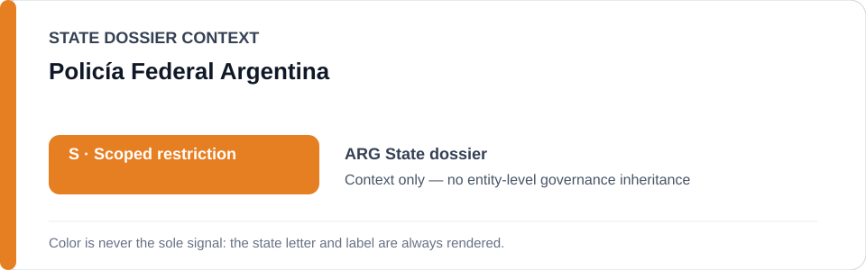
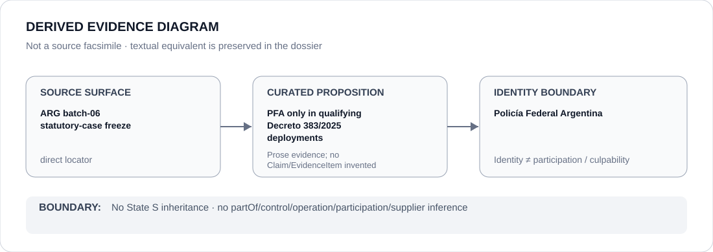

# Policía Federal Argentina

> **Canonical per-entity evidence/provenance record.** This dossier has no licensing effect by itself and carries no standalone `provisional_outcome`.

## Identity scope

The Policía Federal Argentina (PFA), represented as the federal police agency named in the Argentina statutory-case freeze. The PFA identity is broader than the frozen Decreto 383/2025 digital-prevention deployment and must not be collapsed into it.

## State governance context

The canonical `ARG` State dossier records **S — Scoped restriction** for federal protest-policing and intelligence/surveillance projects materially involving unlawful force, arbitrary or warrantless detention, coercive surveillance or political monitoring against protected activity. State `S` is **context only** and is not inherited by PFA as a whole.

## Evidence record

- `batch-06-statutory-cases.yml` names PFA only in implementation of the frozen **Decreto 383/2025** digital-monitoring / identity-establishment powers where the specific deployment independently satisfies ECL §5.
- The freeze limits capacity to the named statutory powers in a qualifying deployment.
- The Argentina State dossier excludes courts, independent accountability, provincial/unrelated services and the population from its scoped determination.

## Attribution and exclusions

Judicially authorized criminal investigation, ordinary crime-prevention use that does not independently satisfy ECL §5, open-source intelligence and identity verification generally are outside the frozen PFA effect. This dossier creates no agency-wide participation or culpability finding.

## Visual evidence

The diagram records PFA as a candidate party only within qualifying Decreto 383/2025 deployments, not as a generic restricted police agency.

## Evidence gaps

The identity source establishes the statutory/deployment boundary but does not itself prove that every use of the powers is coercive, political or unlawful. Specific deployment facts remain proposition-level evidence questions.

## Sources

- [Decreto 383/2025 — official Argentine legal text](https://www.argentina.gob.ar/normativa/nacional/decreto-383-2025-414065/texto)
- [Canonical Argentina State dossier](../states/ARG.md)
- [Statutory-case Schedule freeze](../../registry/schedule-state-s-freezes/batch-06-statutory-cases.yml)

## Governance boundary

PFA identity and statutory capability do not create an agency-wide restriction. Only a specifically evidenced qualifying deployment may engage the frozen project class; ordinary investigation, OSINT and identity verification remain excluded. The orange `S` is State context only.
