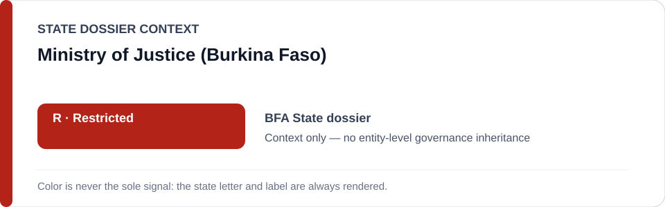
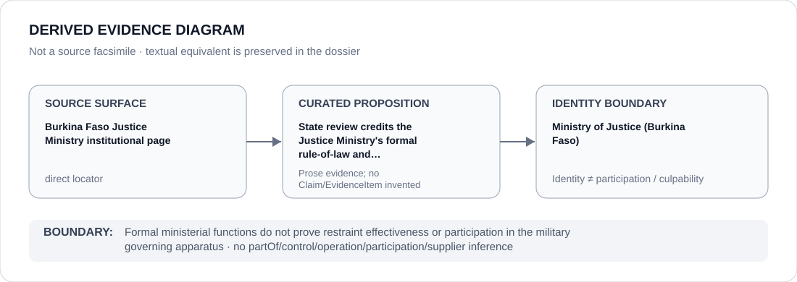

# Ministry of Justice (Burkina Faso)

> **Canonical per-entity evidence/provenance record.** This dossier has no licensing effect by itself and carries no standalone `provisional_outcome`.

## Identity scope

This record materializes `AGENCY-BFA-MINISTRY-JUSTICE` as the dedicated dossier for **Ministry of Justice (Burkina Faso)**. The ABox identity does not by itself establish control, operation, participation, deployment, command, supply, culpability or any ECL governance result.

## State governance context

The canonical `BFA` State dossier records **R — Restricted**. That State status is context only and is **not inherited** by Ministry of Justice (Burkina Faso).

## Evidence record

The Burkina Faso State dossier retains the Ministry's own institutional page as counter-evidence for formal rule-of-law, human-rights and judicial-independence functions. The same dossier finds insufficient evidence that those formal functions independently restrain the current military governing apparatus.

The retained source surface is sufficiently exact for this curated proposition and is recorded as `direct`.

## Attribution and exclusions

The source supports the Ministry's stated institutional functions only. It does not establish effective restraint in politically sensitive matters and is not conduct evidence for the qualifying military-governance project.

## Visual evidence

The diagram encodes the curated proposition **“State review credits the Justice Ministry's formal rule-of-law and human-rights functions as counter-evidence”** and terminates at the identity boundary. It does not create a new `Claim`, `EvidenceItem`, relation edge, Schedule entry or Material Participation finding.

## Evidence gaps

The repository does not establish a generic effectiveness finding for the Ministry or a material-participation link to the military governing apparatus.

## Sources

- [Canonical Burkina Faso State dossier](../states/BFA.md)
- [Burkina Faso Ministry of Justice](https://justice.gov.bf/ministere)

## Governance boundary

Formal ministerial functions do not prove restraint effectiveness or participation in the military governing apparatus. State `R` context, dossier adjacency and source identity never propagate into an agency-level governance outcome.
