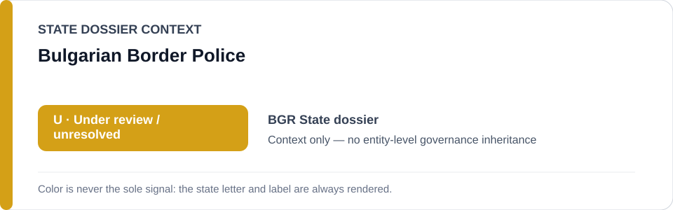
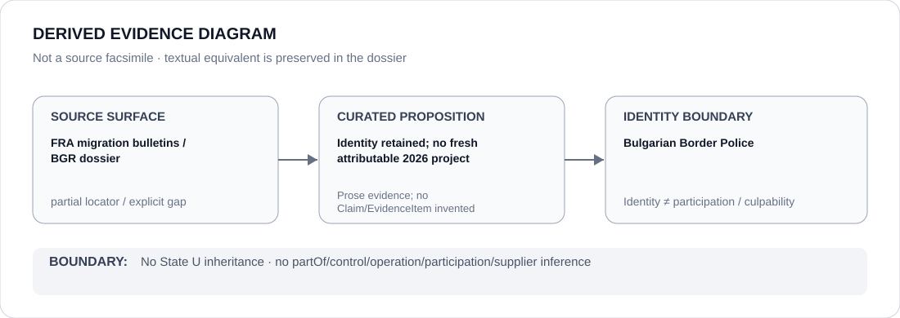

# Bulgarian Border Police

> **Canonical per-entity evidence/provenance record.** This dossier has no licensing effect by itself and carries no standalone `provisional_outcome`.

## Identity scope

Bulgaria's national border-police body, represented separately from any particular Bulgaria–Türkiye border-return, non-assistance or anti-smuggling operation.

## State governance context

The canonical `BGR` State dossier currently records **U — Under Review / unresolved for current restriction**. That status is shown below as **context only** and is not inherited by Bulgarian Border Police.

## Evidence record

- The Bulgaria State dossier retains serious 2025–2026 border-rights evidence, including summary-return, violence and life-protective-assistance concerns in FRA migration reporting.
- The same dossier expressly states that its current record does not identify a sufficiently fresh Bulgaria-specific border operation, unit or finite abusive project to sustain `S`.
- Bulgarian Border Police is explicitly excluded from any generic restriction; a later actor/project finding requires fresh attributable evidence tied to a named operation, unit or finite project.

## Attribution and exclusions

Border-police identity and ordinary border-control capacity do not establish participation in historical pushbacks or future unlawful returns. Lawful border enforcement and anti-smuggling activity remain outside scope absent proposition-specific evidence.

## Visual evidence

The diagram is a derived representation of the current attribution boundary. It is not a source facsimile.

## Evidence gaps

The current 2026 corpus does not supply a fresh named Bulgarian Border Police unit or operation with sufficiently precise abusive attribution. FRA bulletins are therefore preserved as partial provenance rather than converted into a generic agency finding.

## Sources

- [FRA — Migration: Fundamental Rights Issues, Quarterly Bulletin 1/2026](https://fra.europa.eu/en/publication/2026/migration-fundamental-rights-issues-quarterly-bulletin-1-2026)
- [FRA — Migration: Fundamental Rights Issues, Quarterly Bulletin 2/2026](https://fra.europa.eu/en/publication/2026/migration-fundamental-rights-issues-quarterly-bulletin-2-2026)
- [Canonical State dossier provenance](../states/BGR.md)

## Governance boundary

Identity, border-control capacity, historical institutional environment, citation or visual adjacency do not create participation, culpability or Material Participation. A qualifying actor relation requires separate current evidence tied to an objectively knowable project or capacity.

The amber `U` State-context color is a rendering aid only, not an agency-level designation.
