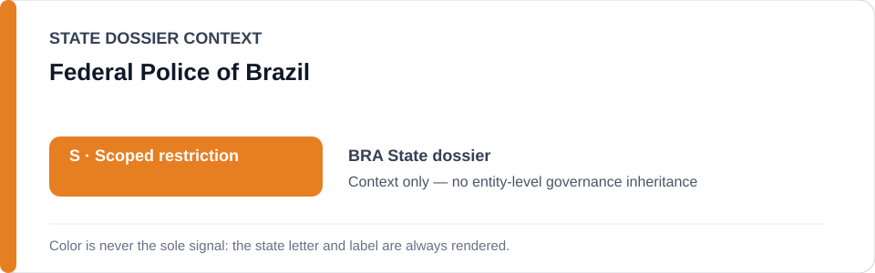
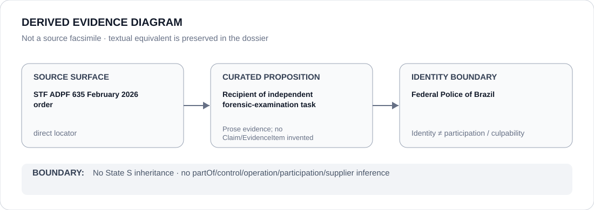

# Federal Police of Brazil

> **Canonical per-entity evidence/provenance record.** This dossier has no licensing effect by itself and carries no standalone `provisional_outcome`.

## Identity scope

Brazil's Federal Police (`Polícia Federal`), represented here only in the proposition-specific forensic/accountability context preserved by the Brazil dossier.

## State governance context

The canonical `BRA` State dossier currently records **S — Scoped restriction** for substantiated State-level police units, commands and operations. That status is shown below as **context only** and is not inherited by the Federal Police.

## Evidence record

- The Brazil State dossier records that the Supreme Federal Court, supervising police policy under ADPF 635, ordered imagery from a February 2026 Rio operation sent to the Federal Police for forensic examination.
- The same dossier treats independent prosecution/forensics and remediation as counter-institutional activity excluded from the active scoped restriction.
- This record identifies a concrete forensic role; it does not establish Federal Police participation in the underlying Rio police operation.

## Attribution and exclusions

Receiving material for independent forensic examination is not evidence of command, operation, obstruction or participation in the conduct being investigated. Any contrary Federal Police project finding would require separate proposition-specific evidence.

## Visual evidence

The diagram is a derived representation of the February 2026 forensic-review provenance, not a source facsimile.

## Evidence gaps

The current per-entity record does not encode the forensic results, chain of custody, later investigative steps or any separate Federal Police operational project as structured Claims/EvidenceItems.

## Sources

- [STF — February 2026 Rio operation imagery order](https://noticias.stf.jus.br/postsnoticias/stf-determina-ao-governo-do-rj-que-apresente-imagens-de-operacao-nos-complexos-do-alemao-e-da-penha/)
- [Canonical State dossier provenance](../states/BRA.md)

## Governance boundary

Identity, receipt of forensic material, citation or visual adjacency do not create participation in the underlying operation, culpability, obstruction or Material Participation. Those require separate structured evidence.

The orange `S` State-context color is a rendering aid only, not an agency-level designation.
