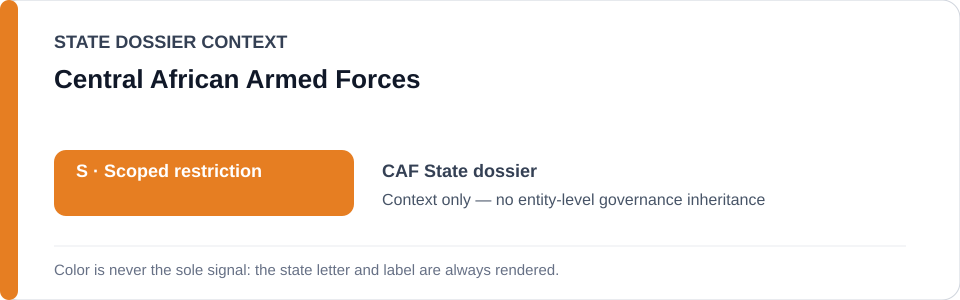
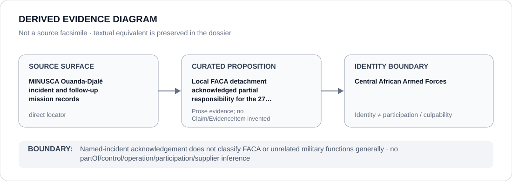

# Central African Armed Forces

> **Canonical per-entity evidence/provenance record.** This dossier has no licensing effect by itself and carries no standalone `provisional_outcome`.

## Identity scope

This record materializes `AGENCY-CAF-FACA` as the dedicated dossier for **Central African Armed Forces**. The ABox identity does not by itself establish control, operation, participation, deployment, command, supply, culpability or any ECL governance result.

## State governance context

The canonical `CAF` State dossier records **S — Scoped restriction**. That State status is context only and is **not inherited** by Central African Armed Forces.

## Evidence record

MINUSCA records the 27 February 2026 Ouanda-Djalé incident and a subsequent joint mission in which the local FACA detachment acknowledged partial responsibility for the events. The current State dossier narrows scope to materially participating FACA personnel/functions in that incident and any separately evidenced current project.

The retained source surface is sufficiently exact for this curated proposition and is recorded as `direct`.

## Attribution and exclusions

FACA identity, national armed-forces status, or deployment in the locality is insufficient to classify unrelated personnel or functions. Accountability/remediation activity and unrelated FACA functions remain excluded.

## Visual evidence

The diagram encodes the curated proposition **“Local FACA detachment acknowledged partial responsibility for the 27 February 2026 Ouanda-Djalé events”** and terminates at the identity boundary. It does not create a new `Claim`, `EvidenceItem`, relation edge, Schedule entry or Material Participation finding.

## Evidence gaps

The record does not identify every individual participant, command decision or function involved in the incident; those require separate evidence.

## Sources

- [Canonical Central African Republic State dossier](../states/CAF.md)
- [MINUSCA Ouanda-Djalé record](https://minusca.unmissions.org/fr/node/134381)
- [MINUSCA follow-up mission](https://minusca.unmissions.org/fr/node/135293)

## Governance boundary

Named-incident acknowledgement does not classify FACA or unrelated military functions generally. State `S` context, dossier adjacency and source identity never propagate into an agency-level governance outcome.
