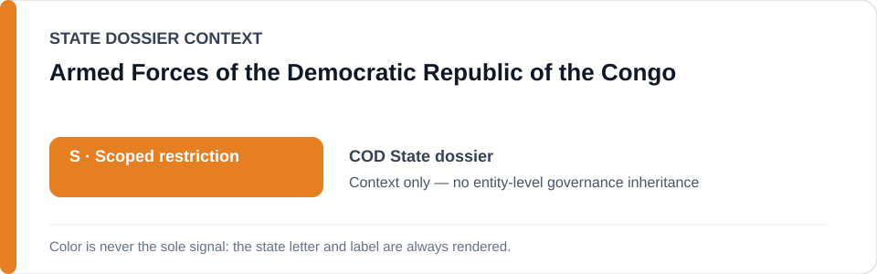
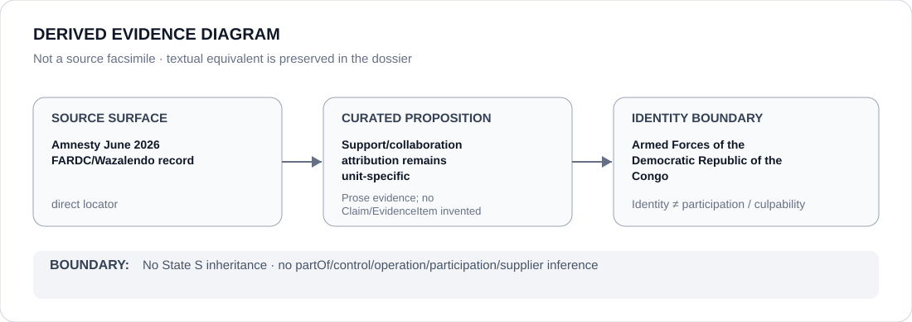

# Armed Forces of the Democratic Republic of the Congo

> **Canonical per-entity evidence/provenance record.** This dossier has no licensing effect by itself and carries no standalone `provisional_outcome`.

## Identity scope

The Armed Forces of the Democratic Republic of the Congo (`FARDC`), represented separately from particular FARDC units, State-backed Wazalendo groups, proxy relationships and operations.

## State governance context

The canonical `COD` State dossier currently records **S — Scoped restriction** for FARDC units and State-backed proxy projects where material support, command, collaboration or knowledge connects the State to substantiated prohibited conduct. That status is shown below as **context only** and is not inherited by FARDC as a whole.

## Evidence record

- Amnesty reporting preserved by the State dossier documents abuses involving FARDC and Wazalendo.
- A June 2026 record describes killings, torture, looting and sexual slavery by CMC-FDP, a Wazalendo group reported as backed by FARDC.
- The State dossier expressly narrows attribution: M23 and ADF crimes remain separately attributable, and FARDC failure to prevent ADF attacks is not converted into perpetration.
- Scope therefore follows evidenced FARDC units and support/command/collaboration relationships, not FARDC identity alone.

## Attribution and exclusions

National armed-forces identity does not prove that every unit, commander, soldier or operation materially participated in the cited conduct. Proxy support also requires proposition-specific evidence of support, command, collaboration or knowledge.

## Visual evidence

The diagram is a derived representation of the unit/project-specific attribution rule, not a source facsimile.

## Evidence gaps

The current per-entity dossier does not enumerate every FARDC unit, commander, support transaction or CMC-FDP relationship as structured Claims/EvidenceItems. Those links remain evidence-dependent and must not be inferred from organizational identity.

## Sources

- [Amnesty International — DRC authorities must end support for armed group suspected of war crimes](https://www.amnesty.org/en/latest/news/2026/06/drc-authorities-must-end-support-for-armed-group-suspected-of-war-crimes/)
- [Canonical State dossier provenance](../states/COD.md)

## Governance boundary

Identity, national military status, alleged proxy support at another granularity, citation or visual adjacency do not create blanket command, control, participation, culpability or Material Participation. Actor/project relations require separate structured evidence.

The orange `S` State-context color is a rendering aid only, not an agency-level designation.
