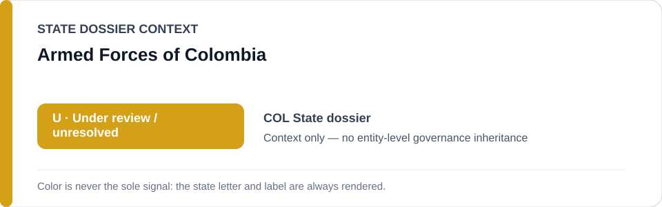
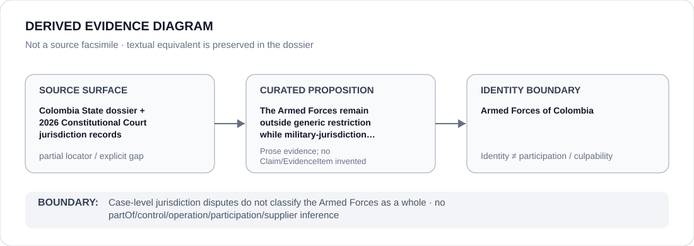

# Armed Forces of Colombia

> **Canonical per-entity evidence/provenance record.** This dossier has no licensing effect by itself and carries no standalone `provisional_outcome`.

## Identity scope

This record materializes `AGENCY-COL-ARMED-FORCES` as the dedicated dossier for **Armed Forces of Colombia**. The ABox identity does not by itself establish control, operation, participation, deployment, command, supply, culpability or any ECL governance result.

## State governance context

The canonical `COL` State dossier records **U — Under review / unresolved**. That State status is context only and is **not inherited** by Armed Forces of Colombia.

## Evidence record

The Colombia State dossier retains 2026 Constitutional Court jurisdiction decisions as governance evidence while downgrading the State finding to `U`. It expressly rejects a generic restriction of the Armed Forces and requires any future escalation to follow a fresh, finite, currently unremediated obstruction project.

The repository preserves the proposition but not a one-to-one source mapping at the same granularity; this dossier therefore records `partial` rather than manufacturing citation precision.

## Attribution and exclusions

The cited cases concern military-versus-ordinary jurisdiction disputes at case level. They do not establish that the Armed Forces as a whole operated, controlled or materially participated in a current qualifying obstruction project.

## Visual evidence

The diagram encodes the curated proposition **“The Armed Forces remain outside generic restriction while military-jurisdiction conflicts stay under monitored case-specific review”** and terminates at the identity boundary. It does not create a new `Claim`, `EvidenceItem`, relation edge, Schedule entry or Material Participation finding.

## Evidence gaps

The repository does not retain a one-to-one locator proving a current Armed Forces-wide proposition; the dossier therefore records this provenance as `partial`.

## Sources

- [Canonical Colombia State dossier](../states/COL.md)
- [Constitutional Court Auto 262/2026](https://www.corteconstitucional.gov.co/relatoria/autos/2026/a262-26.htm)
- [Constitutional Court Auto 337/2026](https://www.corteconstitucional.gov.co/relatoria/autos/2026/a337-26.htm)
- [Constitutional Court Auto 767/2026](https://www.corteconstitucional.gov.co/relatoria/autos/2026/a767-26.htm)

## Governance boundary

Case-level jurisdiction disputes do not classify the Armed Forces as a whole. State `U` context, dossier adjacency and source identity never propagate into an agency-level governance outcome.
