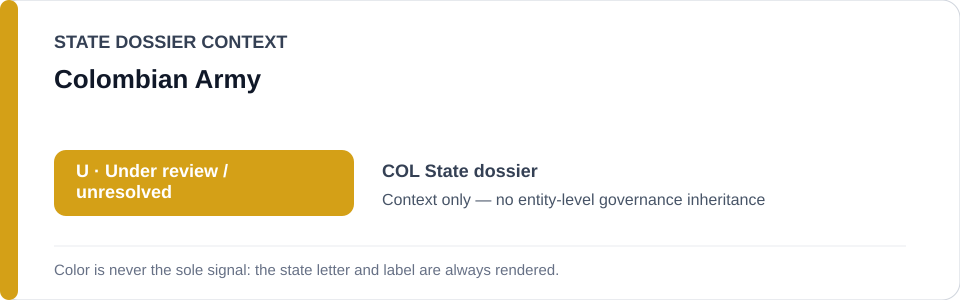
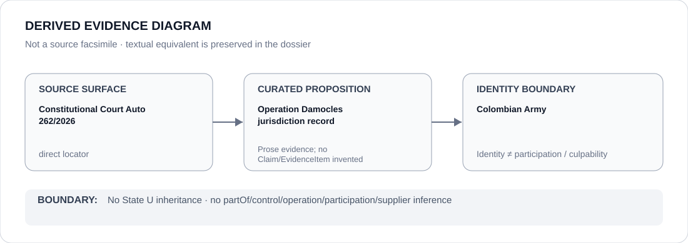

# Colombian Army

> **Canonical per-entity evidence/provenance record.** This dossier has no licensing effect by itself and carries no standalone `provisional_outcome`.

## Identity scope

The Colombian Army, represented only to preserve the exact institutional identity named in the Operation Damocles jurisdictional record.

## State governance context

The canonical `COL` State dossier currently records **U — Under review / unresolved**. That color/status is shown below as **context only**. It is not inherited by Colombian Army.

## Evidence record

- The Colombia State dossier records Constitutional Court Auto 262/2026 (CJU-7386), concerning the December 2024 death of Juan Sebastián Collantes Betancourth during Army operation order 039 "Damocles".
- The Constitutional Court assigned that jurisdictional conflict to the ordinary jurisdiction; the State dossier therefore rejects a generic restriction of the Army or Armed Forces.

## Attribution and exclusions

The existence of the Army identity does not establish participation in an obstruction project, unlawful conduct, command responsibility, or a standalone U outcome. Any future attribution requires separate evidence and a finite intervention.

## Visual evidence

The diagram above is a **derived evidence diagram**, not a source facsimile. Its textual equivalent is the Evidence record, Sources and Evidence gaps sections of this dossier.

## Evidence gaps

No active Army-wide obstruction project is established. The canonical State dossier expressly requires fresh case-level evidence before any future S finding.

## Sources

- [Colombian Constitutional Court — Auto 262/2026](https://www.corteconstitucional.gov.co/relatoria/autos/2026/a262-26.htm)
- [Canonical State dossier provenance](../states/COL.md)

## Governance boundary

Identity, citation, counter-evidence or visual adjacency does not create `partOf`, `controls`, `operates`, `participatesIn`, `deploys`, supplier, command, membership, culpability or Material Participation relations. Any such relation requires separate structured curation.

The state-context color is a rendering aid only. `R`, `S`, `U` or `N` shown for the State dossier is not an actor score and must never be read as an entity-level designation.
