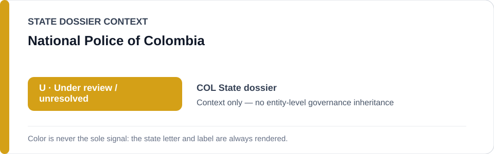
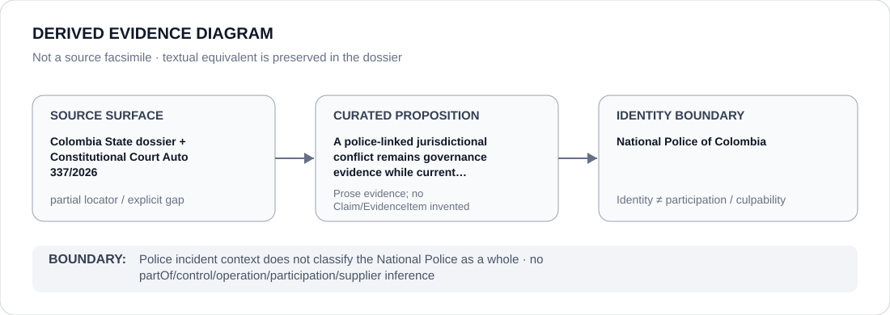

# National Police of Colombia

> **Canonical per-entity evidence/provenance record.** This dossier has no licensing effect by itself and carries no standalone `provisional_outcome`.

## Identity scope

The National Police of Colombia, represented as the national police identity referenced in the broader military-versus-ordinary-jurisdiction accountability record. This dossier does not transform a police-linked case or historical jurisdictional-conflict dataset into a generic National Police obstruction finding.

## State governance context

The canonical `COL` State dossier records **U — Monitor / unresolved for current restriction**. It expressly excludes the National Police from generic restriction and requires any future `S` to follow a fresh named case or finite intervention with current material obstruction. State `U` is context only and is not inherited by the National Police.

## Evidence record

- Amnesty's historical jurisdictional-conflict investigation includes alleged abuses by police and armed-forces personnel but does not establish which exact interventions remain active in August 2026.
- Constitutional Court Auto 337/2026 (`CJU-7374`) concerns the April 2025 death of an eight-year-old girl after a police incident and a later military-jurisdiction claim.
- The Court found the procedural conditions for a jurisdictional conflict incomplete; the canonical dossier therefore treats the current obstruction proposition as unresolved/corrected rather than frozen.

## Attribution and exclusions

A police-linked incident, a military-jurisdiction claim or historical dataset membership does not establish that the National Police as an institution operated, controlled or obstructed an exact current project. Constitutional Court supervision, ordinary investigation and genuine accountability/remedial work remain excluded.

## Visual evidence

The diagram intentionally shows amber `U` as State context and terminates at police identity without creating an agency outcome.

## Evidence gaps

The repository does not preserve a current case-level mapping showing which historical police-linked jurisdictional conflicts remain materially unremediated, nor does Auto 337 alone establish a National Police-wide role. The row is therefore `partial`.

## Sources

- [Canonical Colombia State dossier](../states/COL.md)
- [Amnesty jurisdictional-conflict investigation](https://www.amnesty.org/en/documents/amr23/0356/2025/en/)
- [Constitutional Court Auto 337/2026](https://www.corteconstitucional.gov.co/relatoria/autos/2026/a337-26.htm)

## Governance boundary

National Police identity does not inherit Colombia's `U`, historical police-linked allegations or a military-jurisdiction dispute. Any future restriction requires fresh exact attribution.
