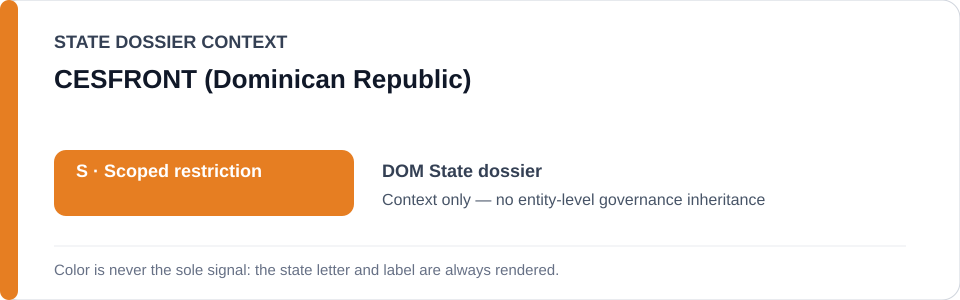
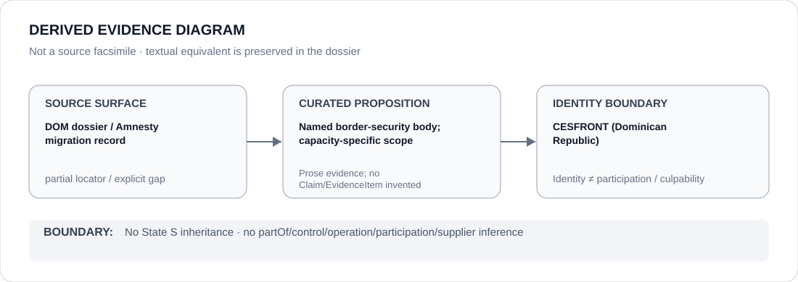

# CESFRONT (Dominican Republic)

> **Canonical per-entity evidence/provenance record.** This dossier has no licensing effect by itself and carries no standalone `provisional_outcome`.

## Identity scope

`CESFRONT`, the Dominican border-security body named in the canonical Dominican Republic migration/border attribution record. The identity is represented separately from any particular detention, deportation or border operation.

## State governance context

The canonical `DOM` State dossier currently records **S — Scoped restriction** for specified migration/border projects materially participating in qualifying conduct. That status is shown below as **context only** and is not inherited by CESFRONT generically.

## Evidence record

- The Dominican Republic State dossier names CESFRONT among the capacities whose projects may enter scope when material participation in collective/discriminatory deportation, racial profiling, arbitrary detention, abusive force or denial of protection procedures is established.
- The same dossier does not make CESFRONT identity itself sufficient for restriction.
- The current canonical source set establishes the broader migration-enforcement record more strongly than it establishes a separately identified 2026 CESFRONT operation.

## Attribution and exclusions

Border-security identity and institutional proximity to DGM operations do not prove participation in every deportation or detention project. Lawful border activity, unrelated functions and personnel absent material participation remain outside scope.

## Visual evidence

The diagram is a derived representation of the capacity-specific attribution boundary and explicitly marks the source locator as partial.

## Evidence gaps

The current dossier does not preserve a proposition-specific 2026 CESFRONT operation/unit locator. A future CESFRONT project finding therefore requires a named operation, unit or other objectively knowable capacity plus evidence of material participation.

## Sources

- [Amnesty International — Dominican Republic report](https://www.amnesty.org/en/location/americas/central-america-and-the-caribbean/dominican-republic/report-dominican-republic/)
- [Canonical State dossier provenance](../states/DOM.md)

## Governance boundary

Identity, border-security capacity, co-location with migration enforcement, citation or visual adjacency do not create participation, control, operation or culpability. Any such relation requires separate structured curation.

The orange `S` State-context color is a rendering aid only, not an agency-level designation.
