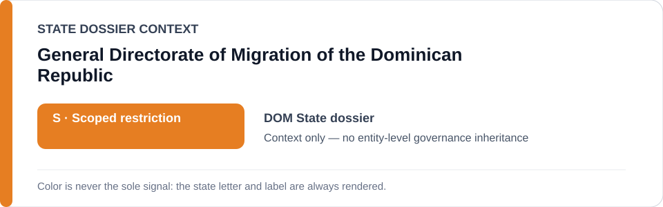
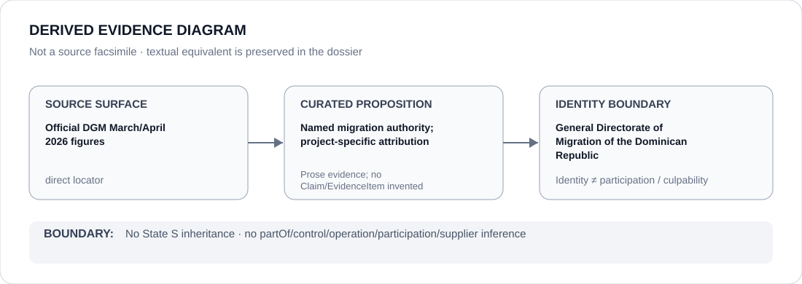

# General Directorate of Migration of the Dominican Republic

> **Canonical per-entity evidence/provenance record.** This dossier has no licensing effect by itself and carries no standalone `provisional_outcome`.

## Identity scope

The Dominican Republic's General Directorate of Migration (`DGM` / `Dirección General de Migración`), represented separately from particular deportation, detention, Rapid Reaction or border-enforcement projects.

## State governance context

The canonical `DOM` State dossier currently records **S — Scoped restriction**, limited to specified migration/border projects materially participating in qualifying conduct. That status is shown below as **context only** and is not inherited by DGM as an undifferentiated agency.

## Evidence record

- Official DGM reporting records 99,268 deportations through March 2026 and 126,790 through April 2026.
- The State dossier records allegations of collective expulsion, racial profiling, arbitrary detention, abusive force and cruel/inhuman treatment in the broader migration-enforcement record.
- DGM's own counter-position states that operations follow Law 285-04 and human-rights/legal protocols and use formal processing centres.
- The canonical scope therefore follows materially participating DGM projects/capacities rather than converting DGM identity alone into a blanket restriction.

## Attribution and exclusions

Official deportation totals establish activity and scale, not by themselves that every removal, employee, facility or DGM function satisfies ECL criteria. Individualized lawful processing, protection screening and unrelated administrative functions remain outside scope absent separate evidence.

## Visual evidence

The diagram is a derived representation of the named authority and project-specific attribution boundary, not a source facsimile.

## Evidence gaps

The current dossier does not map each deportation operation, detention site, command chain or DGM sub-unit to a structured Claim/EvidenceItem. Material Participation therefore remains project/capacity-specific.

## Sources

- [DGM — March 2026 deportation figures](https://migracion.gob.do/en/dgm-deports-99268-undocumented-immigrants-so-far-in-2026-of-which-31310-correspond-to-the-month-of-march/)
- [DGM — April 2026 deportation figures](https://migracion.gob.do/en/immigration-deports-27540-undocumented-immigrants-in-april-total-reaches-126790-in-2026/)
- [Amnesty International — Dominican Republic report](https://www.amnesty.org/en/location/americas/central-america-and-the-caribbean/dominican-republic/report-dominican-republic/)
- [Canonical State dossier provenance](../states/DOM.md)

## Governance boundary

Identity, statutory authority, deportation totals, citation or visual adjacency do not create a generic DGM governance outcome. Only proposition-specific evidence of materially qualifying participation can support an actor/project finding.

The orange `S` State-context color is a rendering aid only, not an agency-level designation.
