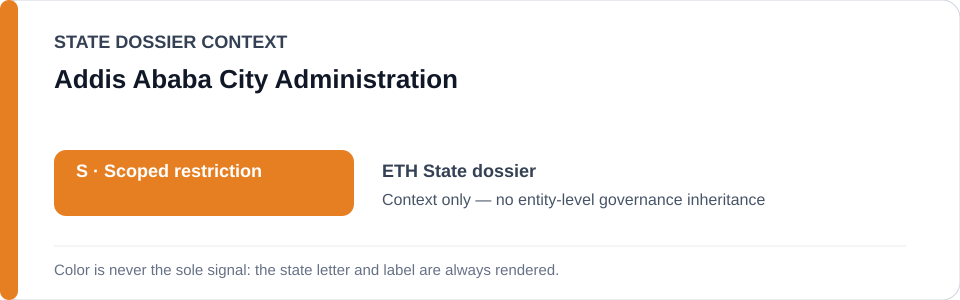
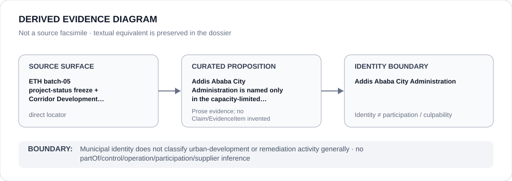

# Addis Ababa City Administration

> **Canonical per-entity evidence/provenance record.** This dossier has no licensing effect by itself and carries no standalone `provisional_outcome`.

## Identity scope

This record materializes `AGENCY-ETH-ADDIS-ABABA-CITY-ADMINISTRATION` as the dedicated dossier for **Addis Ababa City Administration**. The ABox identity does not by itself establish control, operation, participation, deployment, command, supply, culpability or any ECL governance result.

## State governance context

The canonical `ETH` State dossier records **S — Scoped restriction**. That State status is context only and is **not inherited** by Addis Ababa City Administration.

## Evidence record

The ETH project-status freeze names Addis Ababa City Administration only in the Corridor Development relocation/clearance capacity where an implementation independently satisfies the ECL forced-eviction criteria. The freeze also excludes ordinary urban-development activity and remediation, compensation and rights-compliant relocation.

The retained source surface is sufficiently exact for this curated proposition and is recorded as `direct`.

## Attribution and exclusions

Municipal identity does not make all Corridor Development activity or all city administration restrictive. Only separately evidenced materially participating implementation functions within the frozen capacity may enter scope.

## Visual evidence

The diagram encodes the curated proposition **“Addis Ababa City Administration is named only in the capacity-limited Corridor Development relocation/clearance project”** and terminates at the identity boundary. It does not create a new `Claim`, `EvidenceItem`, relation edge, Schedule entry or Material Participation finding.

## Evidence gaps

The freeze identifies the party and project boundary but does not enumerate every subordinate municipal implementation body; unspecified bodies are not collapsed into this identity.

## Sources

- [Canonical Ethiopia State dossier](../states/ETH.md)
- [ETH project-status freeze](../../registry/schedule-state-s-freezes/batch-05-project-status.yml)
- [Corridor and Riverside Development](https://www.corridorandriverside.gov.et/)
- [Amnesty Corridor Development record](https://www.amnesty.org/en/documents/afr25/9021/2025/en/)

## Governance boundary

Municipal identity does not classify urban-development or remediation activity generally. State `S` context, dossier adjacency and source identity never propagate into an agency-level governance outcome.
