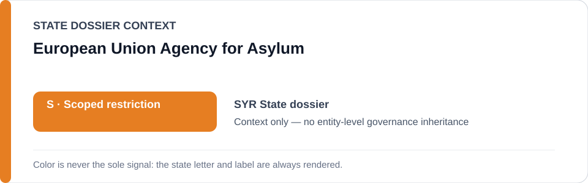
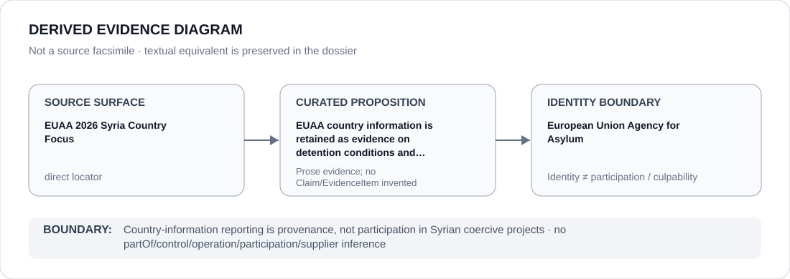

# European Union Agency for Asylum

> **Canonical per-entity evidence/provenance record.** This dossier has no licensing effect by itself and carries no standalone `provisional_outcome`.

## Identity scope

This record materializes `AGENCY-EUAA` as the dedicated dossier for **European Union Agency for Asylum**. The ABox identity does not by itself establish control, operation, participation, deployment, command, supply, culpability or any ECL governance result.

## State governance context

The canonical `SYR` State dossier records **S — Scoped restriction**. That State status is context only and is **not inherited** by European Union Agency for Asylum.

## Evidence record

The Syria State dossier cites EUAA country-information pages on detention conditions and affected communities as evidentiary provenance for the State review. EUAA is represented here as the source-producing agency, not as a Syrian coercive actor.

The retained source surface is sufficiently exact for this curated proposition and is recorded as `direct`.

## Attribution and exclusions

Producing country-of-origin information does not establish participation, control, operational responsibility or governance status in the conduct described by that reporting.

## Visual evidence

The diagram encodes the curated proposition **“EUAA country information is retained as evidence on detention conditions and affected communities in Syria”** and terminates at the identity boundary. It does not create a new `Claim`, `EvidenceItem`, relation edge, Schedule entry or Material Participation finding.

## Evidence gaps

The repository supports the reporting/provenance role directly; it does not establish any material-participation relationship between EUAA and Syrian security or detention projects.

## Sources

- [Canonical Syria State dossier](../states/SYR.md)
- [EUAA detention conditions](https://www.euaa.europa.eu/syria-country-focus/16-prison-conditions-and-treatment-detainees)
- [EUAA Alawites country focus](https://www.euaa.europa.eu/syria-country-focus/272-alawites)

## Governance boundary

Country-information reporting is provenance, not participation in Syrian coercive projects. State `S` context, dossier adjacency and source identity never propagate into an agency-level governance outcome.
