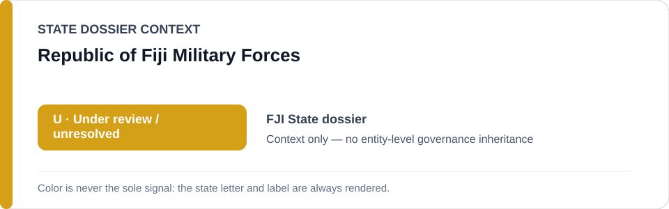
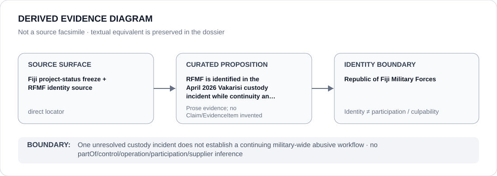

# Republic of Fiji Military Forces

> **Canonical per-entity evidence/provenance record.** This dossier has no licensing effect by itself and carries no standalone `provisional_outcome`.

## Identity scope

This record materializes `AGENCY-FJI-RFMF` as the dedicated dossier for **Republic of Fiji Military Forces**. The ABox identity does not by itself establish control, operation, participation, deployment, command, supply, culpability or any ECL governance result.

## State governance context

The canonical `FJI` State dossier records **U — Under review / unresolved**. That State status is context only and is **not inherited** by Republic of Fiji Military Forces.

## Evidence record

The Fiji current-status record identifies RFMF in the 16–17 April 2026 Jone Vakarisi military-custody incident, while active police/coronial investigation and RFMF cooperation leave responsibility, continuity and remediation under review. The project-status freeze retains an exact RFMF identity source.

The retained source surface is sufficiently exact for this curated proposition and is recorded as `direct`.

## Attribution and exclusions

One grave incident does not establish an open-ended RFMF detention/interrogation project. Unrelated military functions and genuine investigation/accountability activity remain excluded.

## Visual evidence

The diagram encodes the curated proposition **“RFMF is identified in the April 2026 Vakarisi custody incident while continuity and remediation remain under review”** and terminates at the identity boundary. It does not create a new `Claim`, `EvidenceItem`, relation edge, Schedule entry or Material Participation finding.

## Evidence gaps

The current record does not establish that a materially continuous abusive workflow remains deployed and unremediated; that is an explicit review question.

## Sources

- [Canonical Fiji State dossier](../states/FJI.md)
- [Fiji project-status freeze](../../registry/schedule-state-s-freezes/batch-05-project-status.yml)
- [RFMF identity source](https://www.rfmf.mil.fj/contact-us/)
- [Amnesty Vakarisi custody incident](https://www.amnesty.org/en/latest/news/2026/04/fiji-death-of-man-in-military-custody-must-be-promptly-investigated/)

## Governance boundary

One unresolved custody incident does not establish a continuing military-wide abusive workflow. State `U` context, dossier adjacency and source identity never propagate into an agency-level governance outcome.
