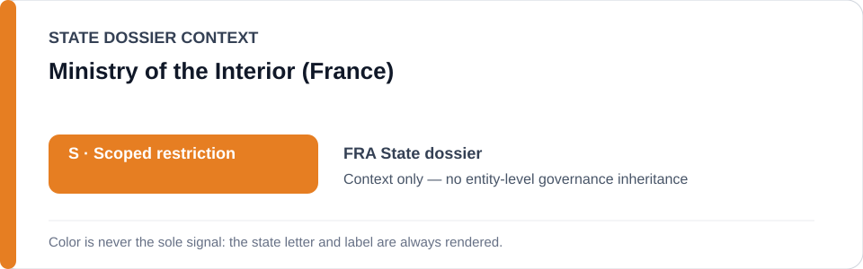
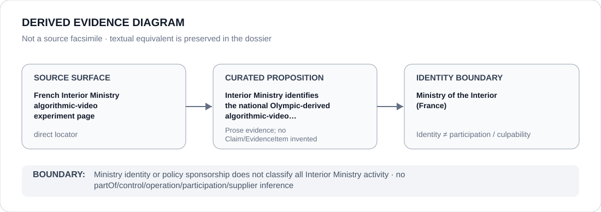

# Ministry of the Interior (France)

> **Canonical per-entity evidence/provenance record.** This dossier has no licensing effect by itself and carries no standalone `provisional_outcome`.

## Identity scope

This record materializes `AGENCY-FRA-MINISTRY-INTERIOR` as the dedicated dossier for **Ministry of the Interior (France)**. The ABox identity does not by itself establish control, operation, participation, deployment, command, supply, culpability or any ECL governance result.

## State governance context

The canonical `FRA` State dossier records **S — Scoped restriction**. That State status is context only and is **not inherited** by Ministry of the Interior (France).

## Evidence record

The France State dossier retains the Interior Ministry's January 2026 page identifying the national Olympic-derived algorithmic-video experiment. Current scope follows only an enacted/materially deployed system that independently satisfies ECL surveillance/repression criteria; the judicially blocked Nice system is excluded.

The retained source surface is sufficiently exact for this curated proposition and is recorded as `direct`.

## Attribution and exclusions

Policy sponsorship or ministry identity does not classify all Interior Ministry functions, proposed legislation or lawful non-repressive video analysis.

## Visual evidence

The diagram encodes the curated proposition **“Interior Ministry identifies the national Olympic-derived algorithmic-video experiment retained for project-level review”** and terminates at the identity boundary. It does not create a new `Claim`, `EvidenceItem`, relation edge, Schedule entry or Material Participation finding.

## Evidence gaps

The exact deployment and qualifying characteristics of each continuation/use still require project-specific evidence; the ministry locator alone is not a participation finding beyond the identified experiment context.

## Sources

- [Canonical France State dossier](../states/FRA.md)
- [French Interior Ministry algorithmic-video experiment](https://www.interieur.gouv.fr/actualites/actualites-du-ministere/experimentation-en-temps-reel-de-cameras-augmentees)

## Governance boundary

Ministry identity or policy sponsorship does not classify all Interior Ministry activity. State `S` context, dossier adjacency and source identity never propagate into an agency-level governance outcome.
