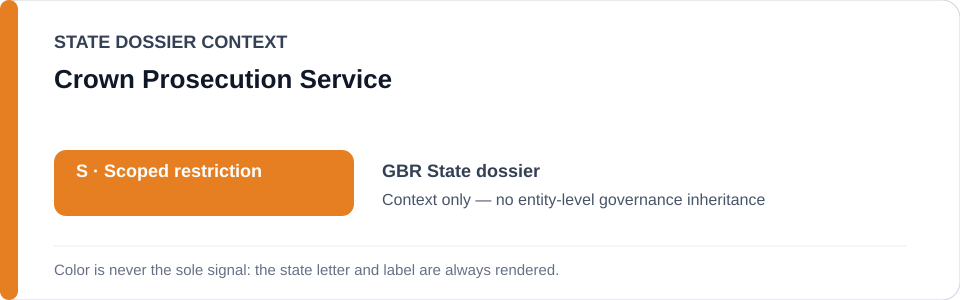
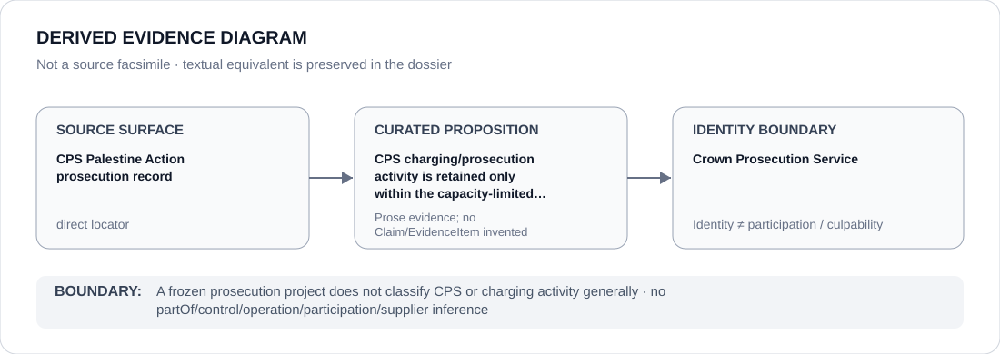

# Crown Prosecution Service

> **Canonical per-entity evidence/provenance record.** This dossier has no licensing effect by itself and carries no standalone `provisional_outcome`.

## Identity scope

This record materializes `AGENCY-GBR-CROWN-PROSECUTION-SERVICE` as the dedicated dossier for **Crown Prosecution Service**. The ABox identity does not by itself establish control, operation, participation, deployment, command, supply, culpability or any ECL governance result.

## State governance context

The canonical `GBR` State dossier records **S — Scoped restriction**. That State status is context only and is **not inherited** by Crown Prosecution Service.

## Evidence record

The UK State dossier and statutory-agency freeze retain the CPS prosecution record as an exact source for Palestine Action-related charging activity. The frozen boundary is capacity-limited to specific charging/prosecution uses that independently satisfy ECL criteria.

The retained source surface is sufficiently exact for this curated proposition and is recorded as `direct`.

## Attribution and exclusions

CPS identity does not classify prosecution activity generally. Violence or serious criminal damage outside the protected-expression nexus and unrelated prosecutions remain outside the frozen project.

## Visual evidence

The diagram encodes the curated proposition **“CPS charging/prosecution activity is retained only within the capacity-limited Palestine Action enforcement project”** and terminates at the identity boundary. It does not create a new `Claim`, `EvidenceItem`, relation edge, Schedule entry or Material Participation finding.

## Evidence gaps

Whether a particular CPS charging decision independently satisfies the ECL threshold remains proposition-specific and cannot be inferred from agency membership.

## Sources

- [Canonical United Kingdom State dossier](../states/GBR.md)
- [CPS Palestine Action prosecution record](https://www.cps.gov.uk/cps/news/cps-announces-further-prosecutions-palestine-action-supporters)
- [GBR statutory-agency freeze](../../registry/schedule-state-s-freezes/batch-02-statutory-agency.yml)

## Governance boundary

A frozen prosecution project does not classify CPS or charging activity generally. State `S` context, dossier adjacency and source identity never propagate into an agency-level governance outcome.
