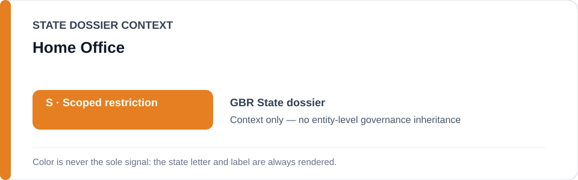
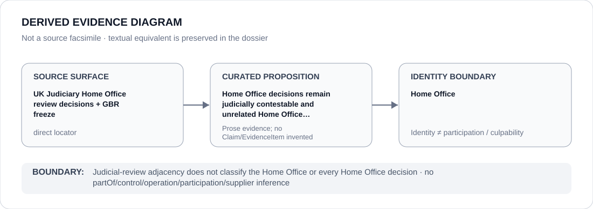

# Home Office

> **Canonical per-entity evidence/provenance record.** This dossier has no licensing effect by itself and carries no standalone `provisional_outcome`.

## Identity scope

This record materializes `AGENCY-GBR-HOME-OFFICE` as the dedicated dossier for **Home Office**. The ABox identity does not by itself establish control, operation, participation, deployment, command, supply, culpability or any ECL governance result.

## State governance context

The canonical `GBR` State dossier records **S — Scoped restriction**. That State status is context only and is **not inherited** by Home Office.

## Evidence record

The UK State dossier retains several Judiciary decisions reviewing Home Office/Home Secretary action, including the Palestine Action proscription litigation and interim relief in another Home Office matter. The current freeze expressly excludes unrelated Home Office functions.

The retained source surface is sufficiently exact for this curated proposition and is recorded as `direct`.

## Attribution and exclusions

Judicial-review adjacency does not classify the Home Office or every decision made by it. Courts and judicial review are counter-institutional/procedural evidence, not a propagation route for State `S`.

## Visual evidence

The diagram encodes the curated proposition **“Home Office decisions remain judicially contestable and unrelated Home Office functions are excluded from the frozen project”** and terminates at the identity boundary. It does not create a new `Claim`, `EvidenceItem`, relation edge, Schedule entry or Material Participation finding.

## Evidence gaps

The sources establish contestability and specific reviewed decisions; they do not support a generic Home Office governance outcome.

## Sources

- [Canonical United Kingdom State dossier](../states/GBR.md)
- [Ammori Divisional Court judgment](https://www.judiciary.uk/judgments/huda-ammori-v-secretary-of-state-for-the-home-department-4/)
- [Home Secretary v Ammori](https://www.judiciary.uk/judgments/home-secretary-v-huda-ammori/)
- [MKR interim-relief decision](https://www.judiciary.uk/judgments/mkr-v-secretary-of-state-for-the-home-department-anonymity-order/)
- [GBR statutory-agency freeze](../../registry/schedule-state-s-freezes/batch-02-statutory-agency.yml)

## Governance boundary

Judicial-review adjacency does not classify the Home Office or every Home Office decision. State `S` context, dossier adjacency and source identity never propagate into an agency-level governance outcome.
