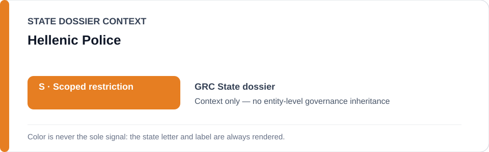
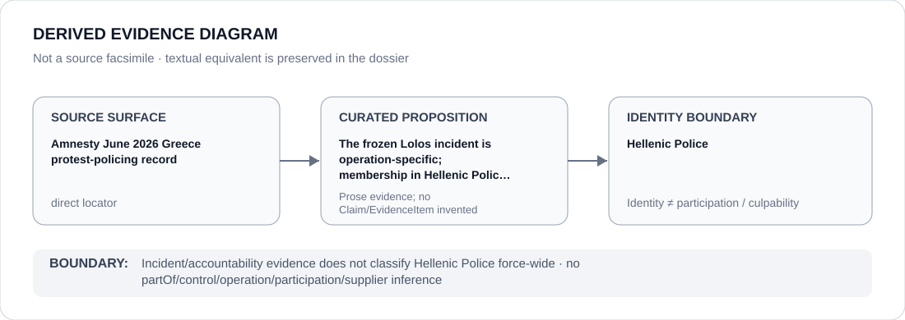

# Hellenic Police

> **Canonical per-entity evidence/provenance record.** This dossier has no licensing effect by itself and carries no standalone `provisional_outcome`.

## Identity scope

This record materializes `AGENCY-GRC-HELLENIC-POLICE` as the dedicated dossier for **Hellenic Police**. The ABox identity does not by itself establish control, operation, participation, deployment, command, supply, culpability or any ECL governance result.

## State governance context

The canonical `GRC` State dossier records **S — Scoped restriction**. That State status is context only and is **not inherited** by Hellenic Police.

## Evidence record

The Greece dossier records current protest-policing evidence and freezes only the 26 January 2025 Marios Lolos stun-grenade incident/accountability project. It expressly states that participation in demonstration policing, riot policing or Hellenic Police membership is not enough by itself.

The retained source surface is sufficiently exact for this curated proposition and is recorded as `direct`.

## Attribution and exclusions

Force-wide identity does not inherit the incident-specific restriction. Criminal/disciplinary investigation, EMIDIPA oversight and unrelated police functions remain outside the frozen project.

## Visual evidence

The diagram encodes the curated proposition **“The frozen Lolos incident is operation-specific; membership in Hellenic Police is expressly insufficient”** and terminates at the identity boundary. It does not create a new `Claim`, `EvidenceItem`, relation edge, Schedule entry or Material Participation finding.

## Evidence gaps

The record does not identify every responsible officer or unit inside Hellenic Police; material participation or obstruction must be established separately.

## Sources

- [Canonical Greece State dossier](../states/GRC.md)
- [Amnesty Greece protest-policing report](https://www.amnesty.org/en/documents/eur25/1012/2026/en/)
- [Amnesty June 2026 policing article](https://www.amnesty.org/en/latest/news/2026/06/greece-dangerous-policing-tactics-have-turned-peaceful-protests-into-battlefields/)
- [Greece Lolos freeze](../../registry/schedule-state-s-freezes/batch-21b-grc-freeze.yml)

## Governance boundary

Incident/accountability evidence does not classify Hellenic Police force-wide. State `S` context, dossier adjacency and source identity never propagate into an agency-level governance outcome.
