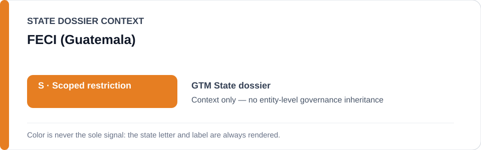
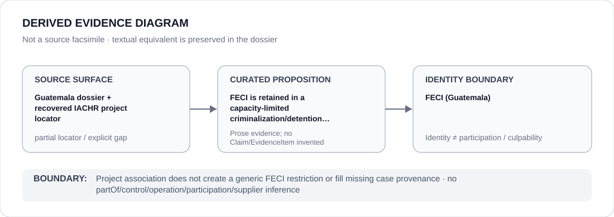

# FECI (Guatemala)

> **Canonical per-entity evidence/provenance record.** This dossier has no licensing effect by itself and carries no standalone `provisional_outcome`.

## Identity scope

This record materializes `AGENCY-GTM-FECI` as the dedicated dossier for **FECI (Guatemala)**. The ABox identity does not by itself establish control, operation, participation, deployment, command, supply, culpability or any ECL governance result.

## State governance context

The canonical `GTM` State dossier records **S — Scoped restriction**. That State status is context only and is **not inherited** by FECI (Guatemala).

## Evidence record

The Guatemala dossier retains FECI within a capacity-limited prosecutorial/criminalization scope and recovers an exact IACHR locator associated with that wider project. The dossier expressly warns that this locator does not independently prove every named detention or criminalization subproposition.

The repository preserves the proposition but not a one-to-one source mapping at the same granularity; this dossier therefore records `partial` rather than manufacturing citation precision.

## Attribution and exclusions

FECI identity or project association is insufficient for a generic restriction. Each prosecution, detention or judicial use must be supported at proposition/case level.

## Visual evidence

The diagram encodes the curated proposition **“FECI is retained in a capacity-limited criminalization/detention scope, with proposition-specific citation gaps still open”** and terminates at the identity boundary. It does not create a new `Claim`, `EvidenceItem`, relation edge, Schedule entry or Material Participation finding.

## Evidence gaps

One-to-one citation mapping remains incomplete for the Pacheco/Chaclán proposition and other subpropositions, so this dossier preserves `partial` source granularity.

## Sources

- [Canonical Guatemala State dossier](../states/GTM.md)
- [Recovered IACHR project locator](https://www.oas.org/en/iachr/decisions/mc/2026/res_40-26_mc_171-25_gt_en.pdf)

## Governance boundary

Project association does not create a generic FECI restriction or fill missing case provenance. State `S` context, dossier adjacency and source identity never propagate into an agency-level governance outcome.
