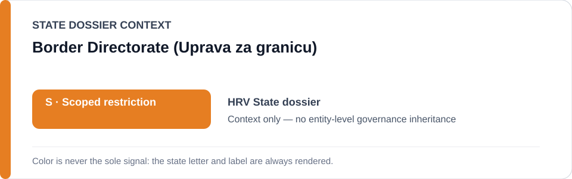
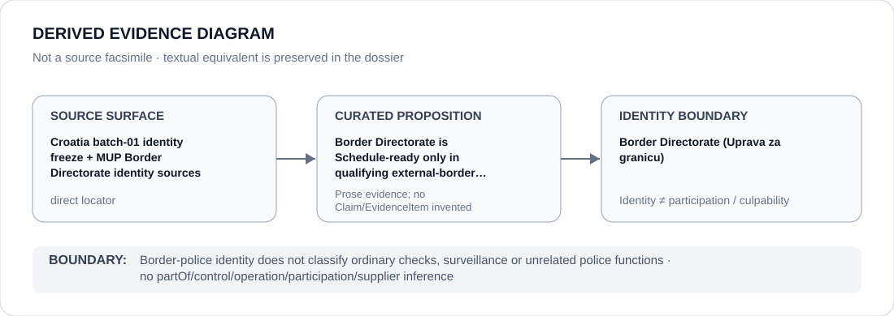

# Border Directorate (Uprava za granicu)

> **Canonical per-entity evidence/provenance record.** This dossier has no licensing effect by itself and carries no standalone `provisional_outcome`.

## Identity scope

This record materializes `AGENCY-HRV-BORDER-DIRECTORATE` as the dedicated dossier for **Border Directorate (Uprava za granicu)**. The ABox identity does not by itself establish control, operation, participation, deployment, command, supply, culpability or any ECL governance result.

## State governance context

The canonical `HRV` State dossier records **S — Scoped restriction**. That State status is context only and is **not inherited** by Border Directorate (Uprava za granicu).

## Evidence record

The Croatia identity freeze directly names the Police Directorate — Border Directorate and preserves two official MUP identity sources. Schedule readiness is limited to external-border operations materially involving violence, summary pushback or obstruction of individualized protection access.

The retained source surface is sufficiently exact for this curated proposition and is recorded as `direct`.

## Attribution and exclusions

The Directorate's identity does not classify ordinary border checks, lawful surveillance, humanitarian/remedial activity or unrelated police functions.

## Visual evidence

The diagram encodes the curated proposition **“Border Directorate is Schedule-ready only in qualifying external-border violence/pushback/protection-obstruction capacity”** and terminates at the identity boundary. It does not create a new `Claim`, `EvidenceItem`, relation edge, Schedule entry or Material Participation finding.

## Evidence gaps

Subordinate units and each qualifying operation still require their own material-participation evidence; the identity freeze does not pre-adjudicate them.

## Sources

- [Canonical Croatia State dossier](../states/HRV.md)
- [Croatia identity freeze](../../registry/schedule-state-s-freezes/batch-01-identity.yml)
- [Croatian MUP border-police meeting](https://mup.gov.hr/vijesti-8/sastanak-predstavnika-granicne-policije-republike-hrvatske-i-republike-kosovo/9512?big=0)
- [Croatian MUP / Frontex liaison record](https://mup.gov.hr/vijesti/casnica-za-vezu-frontexa-posjetila-ravnateljstvo-policije/282413)

## Governance boundary

Border-police identity does not classify ordinary checks, surveillance or unrelated police functions. State `S` context, dossier adjacency and source identity never propagate into an agency-level governance outcome.
