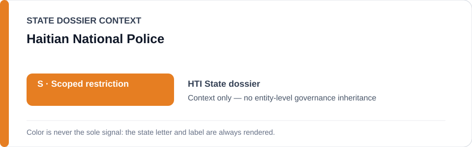
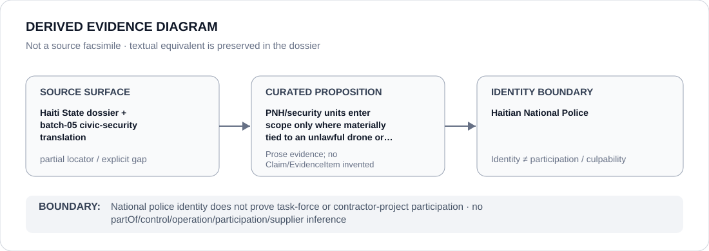

# Haitian National Police

> **Canonical per-entity evidence/provenance record.** This dossier has no licensing effect by itself and carries no standalone `provisional_outcome`.

## Identity scope

The Haitian National Police (PNH), represented as the national police identity named in the Haiti scoped security record. The dossier preserves only the proposition that materially participating PNH/security units may become relevant to an exact unlawful drone, summary-execution or comparable coercive targeting project; it does not identify PNH as the Security Task Force or as a contractor.

## State governance context

The canonical `HTI` State dossier records **S — Scoped restriction** for a Prime-Minister-created Security Task Force, attributable security/PNH units and materially participating contractors in defined unlawful targeting projects. State `S` is context only and is not inherited by PNH.

## Evidence record

- The Haiti dossier preserves 2026 reporting of apparently unlawful lethal drone strikes and probable extrajudicial executions involving a specialized State-linked Task Force and contractor support.
- Its attribution rule reaches PNH/security units only where their material participation in that project is separately established.
- `batch-05-civic-security.yml` preserves the Amnesty Haiti locator as project context, while the canonical dossier explicitly records that the exact BINUH/UN locator for the specialized drone programme remains missing.

## Attribution and exclusions

PNH identity, police mandate or general security cooperation does not establish membership in the Task Force, contractor relationships, drone operation, targeting, command or Material Participation. Internal-affairs and judicial accountability functions remain excluded.

## Visual evidence

The diagram displays a `partial` source surface because the repo preserves the PNH attribution rule but not a complete proposition-specific locator chain for the specialized drone programme.

## Evidence gaps

The exact BINUH/UN locator for the drone programme and exact unit-level PNH participation remain unresolved in the repository. Those gaps are not filled from external memory or institutional hierarchy.

## Sources

- [Canonical Haiti State dossier](../states/HTI.md)
- [Civic-security Schedule batch](../../registry/schedule-state-s-batches/batch-05-civic-security.yml)
- [Amnesty International — Haiti country record](https://www.amnesty.org/en/location/americas/central-america-and-the-caribbean/haiti/report-haiti/)

## Governance boundary

PNH is a stable national police identity, not a proxy for the specialized Task Force or every State-linked security project. The orange `S` is State context only.
