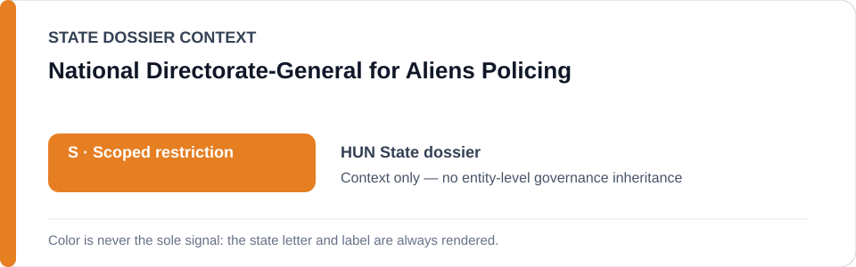
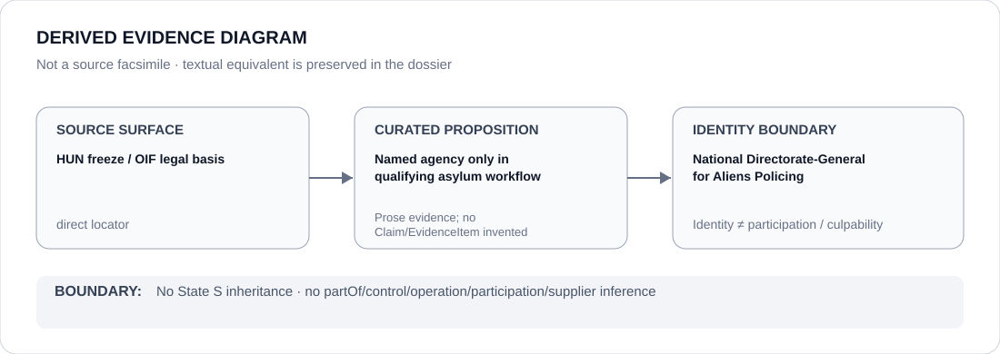

# National Directorate-General for Aliens Policing

> **Canonical per-entity evidence/provenance record.** This dossier has no licensing effect by itself and carries no standalone `provisional_outcome`.

## Identity scope

Hungary's National Directorate-General for Aliens Policing (`Országos Idegenrendészeti Főigazgatóság`), represented as the administration named in the HUN identified-project freeze. The identity is limited to this Hungarian agency and does not absorb generic Hungarian border-police functions.

## State governance context

The canonical `HUN` State dossier currently records **S — Scoped restriction**, narrowed to currently operative asylum/border-pushback and emergency-migration systems materially denying individualized protection, non-refoulement safeguards or meaningful contestability. That status is **context only** and is not inherited by this agency.

## Evidence record

- `batch-07-identified-projects.yml` lists the National Directorate-General for Aliens Policing as a candidate party **only in the qualifying asylum/protection workflow** described by that freeze.
- The freeze separately identifies the mass-migration state-of-crisis asylum/border workflow under Government Decree 41/2016 (III. 9), as extended by Government Decree 41/2026 (III. 5), and limits scope to implementation that materially bypasses individualized protection/non-refoulement review and independently satisfies ECL §5.6.
- The official OIF locator identifies the administration; the State dossier expressly warns that the legal/administrative locators do not by themselves establish ECL-prohibited implementation.

## Attribution and exclusions

Agency identity does not prove participation in every implementation of the emergency-migration workflow. Ordinary asylum processing, reception/support, temporary-protection support, courts, legal remedies and qualifying Independent Remediation Activity are excluded by the freeze. Generic immigration or border administration is not restricted by adjacency to this dossier.

## Visual evidence

The diagram records the agency as a named candidate only within the qualifying workflow and stops before any inference of generic agency participation or State-status inheritance.

## Evidence gaps

The repository does not yet encode a complete project-specific actor-participation record showing which agency functions materially implemented qualifying conduct after the 2026 extension. The State dossier also preserves historical factual-locator gaps for current pushback effects. Those gaps are not filled by treating the decrees or OIF identity page as conduct proof.

## Sources

- [Government Decree 41/2016 (III. 9)](https://njt.jog.gov.hu/jogszabaly/2016-41-20-22)
- [Government Decree 41/2026 (III. 5)](https://njt.jog.gov.hu/jogszabaly/2026-41-20-22)
- [National Directorate-General for Aliens Policing — general information](https://oif.gov.hu/index.php/general-information)
- [Canonical Hungary State dossier](../states/HUN.md)
- [Identified-project Schedule freeze](../../registry/schedule-state-s-freezes/batch-07-identified-projects.yml)

## Governance boundary

A named candidate agency in a narrowly frozen workflow does not inherit the Hungarian State's `S`, and identity does not create participation, control, command, culpability or Material Participation.
