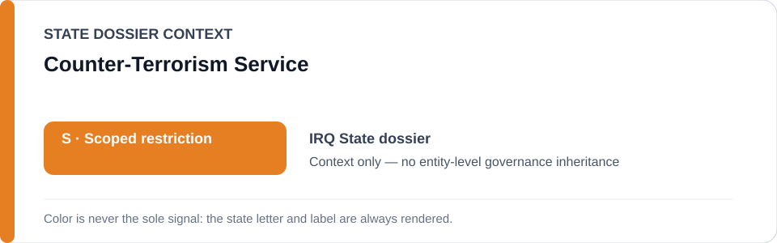
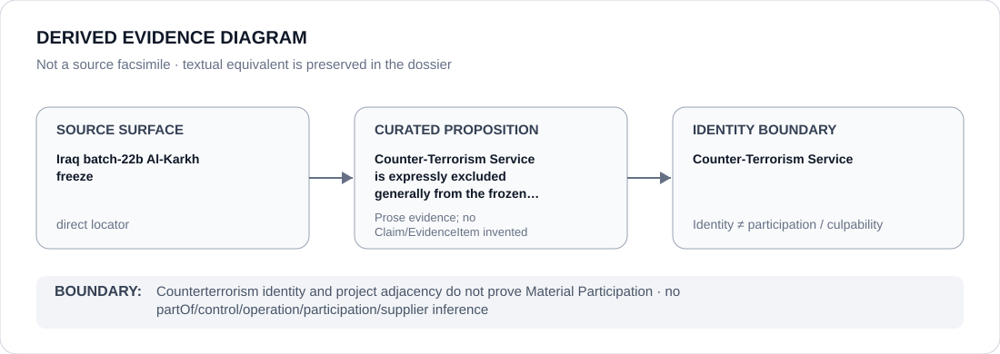

# Counter-Terrorism Service

> **Canonical per-entity evidence/provenance record.** This dossier has no licensing effect by itself and carries no standalone `provisional_outcome`.

## Identity scope

This record materializes `AGENCY-IRQ-COUNTER-TERRORISM-SERVICE` as the dedicated dossier for **Counter-Terrorism Service**. The ABox identity does not by itself establish control, operation, participation, deployment, command, supply, culpability or any ECL governance result.

## State governance context

The canonical `IRQ` State dossier records **S — Scoped restriction**. That State status is context only and is **not inherited** by Counter-Terrorism Service.

## Evidence record

The Iraq Al-Karkh freeze expressly names the Counter-Terrorism Service among entities excluded from generic attribution. The frozen project reaches only materially participating custodial/interrogation functions within the transferred-detainee abusive-capacity boundary.

The retained source surface is sufficiently exact for this curated proposition and is recorded as `direct`.

## Attribution and exclusions

Counterterrorism mandate, institutional proximity or co-reference with the transferred cohort does not establish Material Participation. Lawful individualized investigation and unrelated CTS activity remain excluded.

## Visual evidence

The diagram encodes the curated proposition **“Counter-Terrorism Service is expressly excluded generally from the frozen transferred-detainee abusive-capacity project”** and terminates at the identity boundary. It does not create a new `Claim`, `EvidenceItem`, relation edge, Schedule entry or Material Participation finding.

## Evidence gaps

The repository establishes the exclusion/boundary directly but does not encode a generic role for CTS in the frozen abusive capacities.

## Sources

- [Canonical Iraq State dossier](../states/IRQ.md)
- [Iraq Al-Karkh exact freeze](../../registry/schedule-state-s-freezes/batch-22b-irq-freeze.yml)

## Governance boundary

Counterterrorism identity and project adjacency do not prove Material Participation. State `S` context, dossier adjacency and source identity never propagate into an agency-level governance outcome.
