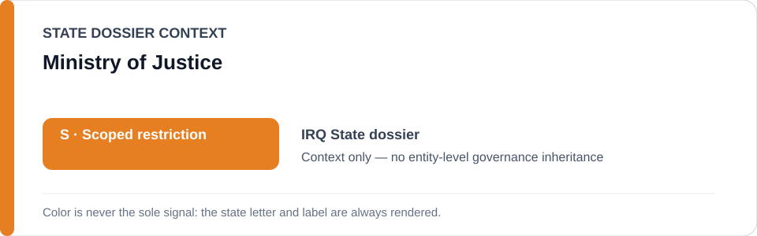
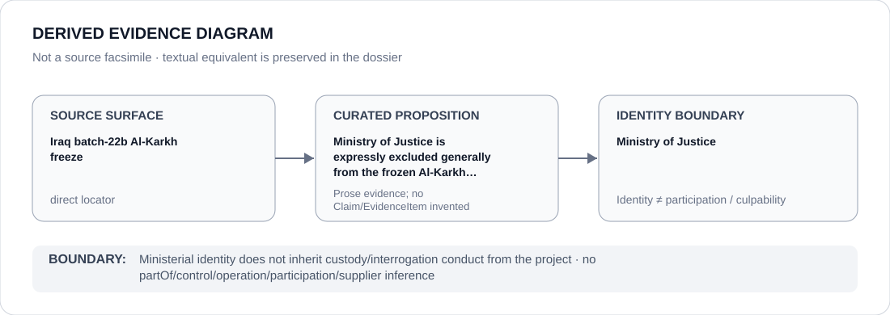

# Ministry of Justice

> **Canonical per-entity evidence/provenance record.** This dossier has no licensing effect by itself and carries no standalone `provisional_outcome`.

## Identity scope

This record materializes `AGENCY-IRQ-MINISTRY-OF-JUSTICE` as the dedicated dossier for **Ministry of Justice**. The ABox identity does not by itself establish control, operation, participation, deployment, command, supply, culpability or any ECL governance result.

## State governance context

The canonical `IRQ` State dossier records **S — Scoped restriction**. That State status is context only and is **not inherited** by Ministry of Justice.

## Evidence record

The Iraq Al-Karkh freeze expressly names the Ministry of Justice among entities excluded from generic attribution. Scope remains confined to materially participating abusive custodial/interrogation capacities in the transferred-detainee project.

The retained source surface is sufficiently exact for this curated proposition and is recorded as `direct`.

## Attribution and exclusions

Ministerial identity or administrative adjacency to detention does not establish operation, control or Material Participation. Lawful custody, remediation and unrelated ministry functions remain excluded.

## Visual evidence

The diagram encodes the curated proposition **“Ministry of Justice is expressly excluded generally from the frozen Al-Karkh abusive-capacity project”** and terminates at the identity boundary. It does not create a new `Claim`, `EvidenceItem`, relation edge, Schedule entry or Material Participation finding.

## Evidence gaps

The repository establishes the generic exclusion directly; any narrower Ministry function alleged to participate would require separate evidence.

## Sources

- [Canonical Iraq State dossier](../states/IRQ.md)
- [Iraq Al-Karkh exact freeze](../../registry/schedule-state-s-freezes/batch-22b-irq-freeze.yml)

## Governance boundary

Ministerial identity does not inherit custody/interrogation conduct from the project. State `S` context, dossier adjacency and source identity never propagate into an agency-level governance outcome.
