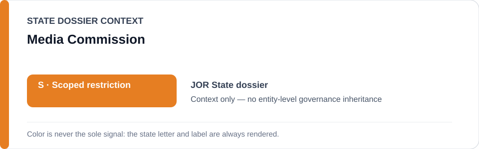
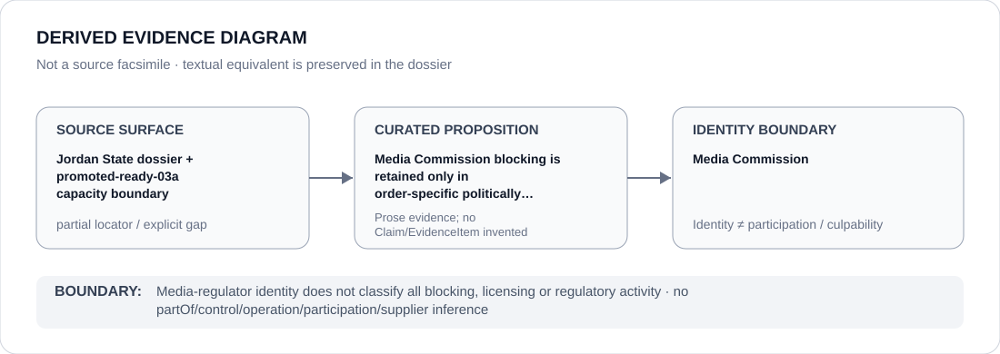

# Media Commission

> **Canonical per-entity evidence/provenance record.** This dossier has no licensing effect by itself and carries no standalone `provisional_outcome`.

## Identity scope

This record materializes `AGENCY-JOR-MEDIA-COMMISSION` as the dedicated dossier for **Media Commission**. The ABox identity does not by itself establish control, operation, participation, deployment, command, supply, culpability or any ECL governance result.

## State governance context

The canonical `JOR` State dossier records **S — Scoped restriction**. That State status is context only and is **not inherited** by Media Commission.

## Evidence record

The Jordan State dossier records blocking of 12 media websites by the Media Commission and later preserves a renderable State Security Court / Media Commission / governor-detention project class. That promotion remains case/order-specific and does not create a generic media-regulatory class.

The repository preserves the proposition but not a one-to-one source mapping at the same granularity; this dossier therefore records `partial` rather than manufacturing citation precision.

## Attribution and exclusions

Media Commission identity does not classify licensing, blocking or regulatory activity generally. Only a specific politically grounded order/use that independently satisfies the criteria may enter scope.

## Visual evidence

The diagram encodes the curated proposition **“Media Commission blocking is retained only in order-specific politically grounded media-control projects”** and terminates at the identity boundary. It does not create a new `Claim`, `EvidenceItem`, relation edge, Schedule entry or Material Participation finding.

## Evidence gaps

The State dossier does not retain a one-to-one Media Commission source locator for every blocking proposition; source granularity therefore remains `partial`.

## Sources

- [Canonical Jordan State dossier](../states/JOR.md)
- [Jordan promoted capacity boundary](../../registry/schedule-state-s-freezes/promoted-ready-03a.yml)
- [Amnesty Jordan country record](https://www.amnesty.org/en/location/middle-east-and-north-africa/middle-east/jordan/report-jordan/)

## Governance boundary

Media-regulator identity does not classify all blocking, licensing or regulatory activity. State `S` context, dossier adjacency and source identity never propagate into an agency-level governance outcome.
