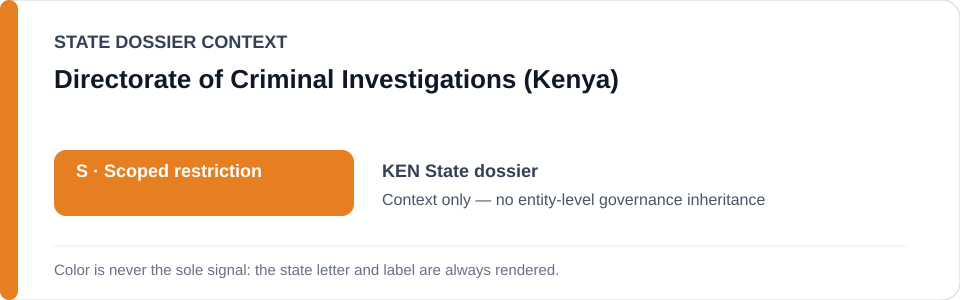
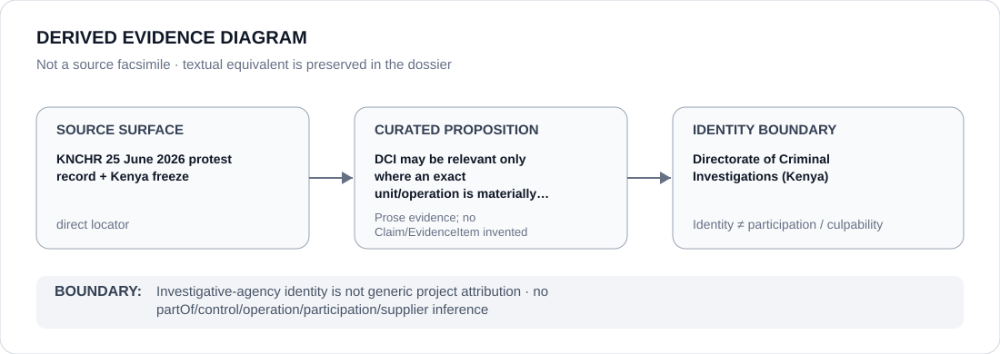

# Directorate of Criminal Investigations (Kenya)

> **Canonical per-entity evidence/provenance record.** This dossier has no licensing effect by itself and carries no standalone `provisional_outcome`.

## Identity scope

The Directorate of Criminal Investigations (DCI), represented as the Kenyan investigative body named in the State dossier and Schedule translation for attributable protest/security projects. The identity record does not itself attribute disappearance, torture, detention, surveillance or protest-force conduct to DCI.

## State governance context

The canonical `KEN` State dossier records **S — Scoped restriction** for attributable coercive public-order/security projects. State `S` is context only and is not inherited by DCI.

## Evidence record

- KNCHR's 29 June 2026 record documents enforced disappearance, secret detention/torture allegations, arbitrary arrests, unlawful force and media-freedom violations following the 25 June protests.
- The State dossier and Schedule translation identify police/DCI only where an exact unit or operation is materially involved in the qualifying conduct.
- `batch-14a-ken-freeze.yml` narrows current renderability to the exact six-person Parliament-arrest incident cohort rather than DCI generally.

## Attribution and exclusions

DCI's investigative mandate, institutional membership or co-reference with Kenyan security operations is insufficient for project attribution. Only a separately evidenced DCI unit/function materially participating in the exact coercive operation could enter scope. Independent oversight, courts, prosecutors acting remedially and unrelated investigations remain excluded.

## Visual evidence

The diagram records the KNCHR/freeze proposition and stops at DCI identity; it does not convert the parent agency into the frozen project.

## Evidence gaps

The current repository evidence does not identify every participating unit or officer inside DCI. Project-specific role, custody chain, command and Material Participation require their own evidence.

## Sources

- [Canonical Kenya State dossier](../states/KEN.md)
- [Kenya exact freeze](../../registry/schedule-state-s-freezes/batch-14a-ken-freeze.yml)
- [Schedule State-S translations](../../registry/schedule-state-s-translations.yml)
- [KNCHR — 25 June 2026 protest violations](https://www.knchr.org/Articles/ArtMID/2432/ArticleID/1258/Enforced-Disappearances-Torture-and-other-Human-Rights-Violations-following-the-25th-June-2026-Protests-Marking-the-2nd-Anniversary-of-the-2024-Gen-Z-Protests)

## Governance boundary

DCI identity is not a generic restriction, participation finding or command attribution. The orange `S` is State context only; applicability remains exact-project, exact-capacity and evidence dependent.
