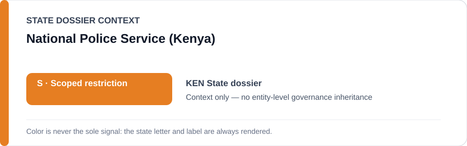
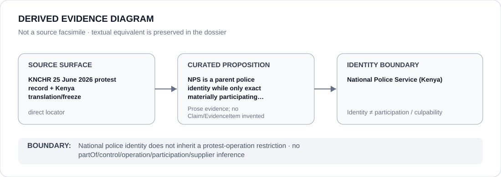

# National Police Service (Kenya)

> **Canonical per-entity evidence/provenance record.** This dossier has no licensing effect by itself and carries no standalone `provisional_outcome`.

## Identity scope

The National Police Service (NPS), represented as the nationwide Kenyan police identity referenced by the State dossier and Schedule translation. The canonical record expressly distinguishes that parent identity from the exact units and operations that may be materially attributable to a qualifying project.

## State governance context

The canonical `KEN` State dossier records **S — Scoped restriction** for attributable coercive public-order/security projects. State `S` is context only and is not inherited by NPS.

## Evidence record

- KNCHR's 29 June 2026 record documents serious violations linked to the 25 June protests, including enforced disappearances, alleged secret detention/torture, arbitrary arrests, unlawful force and media-freedom violations.
- The Schedule translation uses NPS/DCI only as capacity-limited candidate surfaces; NPS activity generally is expressly excluded.
- `batch-14a-ken-freeze.yml` narrows renderability to the exact six-person Parliament-arrest incident cohort and does not freeze the nationwide police service.

## Attribution and exclusions

Service membership, command hierarchy or participation in protest policing generally does not prove Material Participation in the frozen project. Unrelated policing, lawful public-order activity, investigators acting remedially and personnel without a separately evidenced role are excluded.

## Visual evidence

The diagram shows a parent police identity adjacent to an exact incident boundary without propagating that incident to NPS as a whole.

## Evidence gaps

The repository does not identify every exact NPS unit or officer connected to the frozen cohort. Any future expansion requires unit-level or role-level evidence; institutional hierarchy alone is insufficient.

## Sources

- [Canonical Kenya State dossier](../states/KEN.md)
- [Kenya exact freeze](../../registry/schedule-state-s-freezes/batch-14a-ken-freeze.yml)
- [Schedule State-S translations](../../registry/schedule-state-s-translations.yml)
- [KNCHR — 25 June 2026 protest violations](https://www.knchr.org/Articles/ArtMID/2432/ArticleID/1258/Enforced-Disappearances-Torture-and-other-Human-Rights-Violations-following-the-25th-June-2026-Protests-Marking-the-2nd-Anniversary-of-the-2024-Gen-Z-Protests)

## Governance boundary

NPS is a stable agency identity, not a synonym for the qualifying project. The orange `S` is State context only and creates no NPS-wide restriction, control, command or culpability inference.
