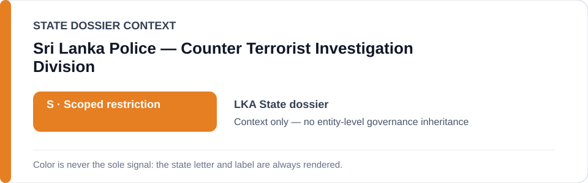
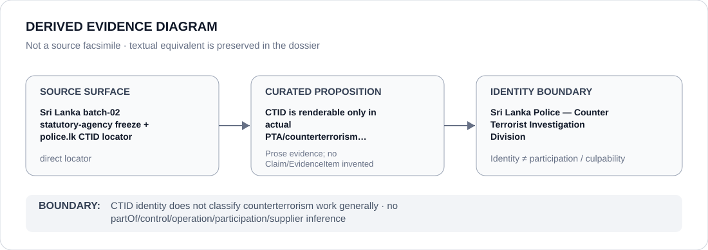

# Sri Lanka Police — Counter Terrorist Investigation Division

> **Canonical per-entity evidence/provenance record.** This dossier has no licensing effect by itself and carries no standalone `provisional_outcome`.

## Identity scope

This record materializes **Sri Lanka Police — Counter Terrorist Investigation Division** as a canonical Agency identity. Identity, mandate, parent hierarchy, source production or adjacency to a State project does not by itself establish Material Participation, control, operation, culpability or a governance outcome.

## State governance context

The canonical `LKA` State dossier records **S — Scoped restriction**. State `S` is context only and is not inherited by this Agency.

## Evidence record

The current Schedule-preparation freeze names Sri Lanka Police — CTID only for actual PTA/counterterrorism detention, investigation or surveillance of protected journalism, memorialisation or defender activity where the specific use independently satisfies ECL criteria.

Source granularity is **direct**. The repository retains an exact source/freeze surface adequate for this curated proposition.

## Attribution and exclusions

CTID identity does not classify counterterrorism work generally. The dossier creates no `partOf`, control, operation, participation, deployment, command, supplier or culpability edge from institutional hierarchy or evidence adjacency. Remedial, oversight, judicial and unrelated lawful functions remain excluded unless separately evidenced.

## Visual evidence

The diagram renders `source surface → curated proposition → identity boundary`; it is not a source facsimile and does not invent a `Claim` or `EvidenceItem`.

## Evidence gaps

Identity and capacity are resolved, but each qualifying use still requires project/case evidence; draft replacement legislation and unrelated counterterrorism work remain excluded.

## Sources

- [Sri Lanka State dossier](../states/LKA.md)
- [Statutory-agency freeze](../../registry/schedule-state-s-freezes/batch-02-statutory-agency.yml)
- [Sri Lanka Police CTID identity](https://www.police.lk/?page_id=1301)

## Governance boundary

This canonical dossier is an identity/provenance surface only. State context, statutory capacity, parent/subordinate naming, project proximity and evidence production never propagate into an Agency-level restriction without separate proposition-specific evidence.
