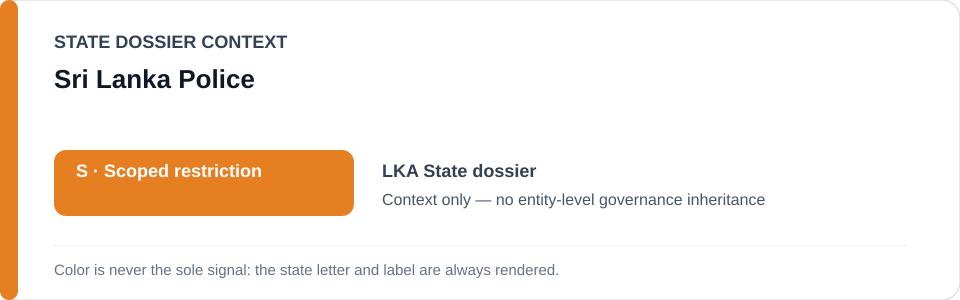
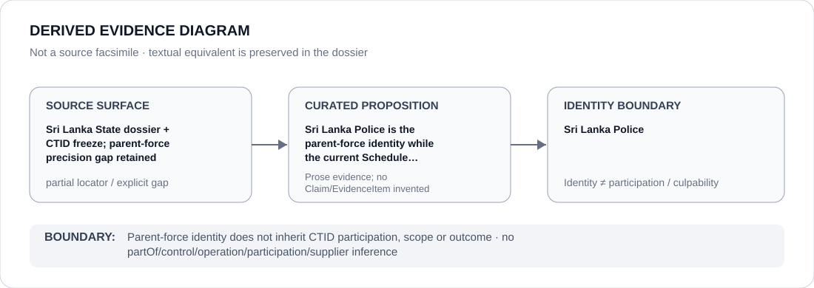

# Sri Lanka Police

> **Canonical per-entity evidence/provenance record.** This dossier has no licensing effect by itself and carries no standalone `provisional_outcome`.

## Identity scope

This record materializes **Sri Lanka Police** as a canonical Agency identity. Identity, mandate, parent hierarchy, source production or adjacency to a State project does not by itself establish Material Participation, control, operation, culpability or a governance outcome.

## State governance context

The canonical `LKA` State dossier records **S — Scoped restriction**. State `S` is context only and is not inherited by this Agency.

## Evidence record

The State dossier and batch-02 freeze resolve the narrower CTID identity and expressly avoid a generic Sri Lanka Police restriction. The parent-force record exists to preserve that non-propagation boundary.

Source granularity is **partial**. The repository retains the proposition/context but not a one-to-one exact locator at the same identity/proposition granularity; that gap remains explicit.

## Attribution and exclusions

Parent-force identity does not inherit CTID participation, scope or outcome. The dossier creates no `partOf`, control, operation, participation, deployment, command, supplier or culpability edge from institutional hierarchy or evidence adjacency. Remedial, oversight, judicial and unrelated lawful functions remain excluded unless separately evidenced.

## Visual evidence

The diagram renders `source surface → curated proposition → identity boundary`; it is not a source facsimile and does not invent a `Claim` or `EvidenceItem`.

## Evidence gaps

The retained exact identity locator is CTID-specific rather than a separate one-to-one parent-force source surface. No parent-force participation, command or generic restriction is inferred.

## Sources

- [Sri Lanka State dossier](../states/LKA.md)
- [CTID statutory-agency freeze](../../registry/schedule-state-s-freezes/batch-02-statutory-agency.yml)

## Governance boundary

This canonical dossier is an identity/provenance surface only. State context, statutory capacity, parent/subordinate naming, project proximity and evidence production never propagate into an Agency-level restriction without separate proposition-specific evidence.
