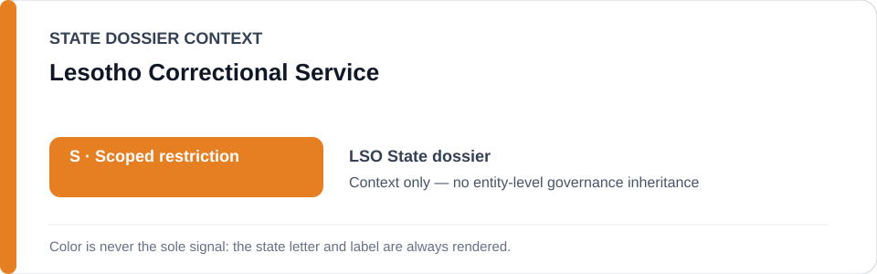
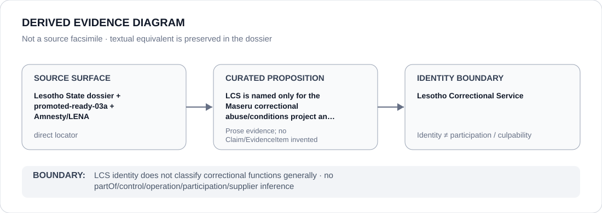

# Lesotho Correctional Service

> **Canonical per-entity evidence/provenance record.** This dossier has no licensing effect by itself and carries no standalone `provisional_outcome`.

## Identity scope

This record materializes **Lesotho Correctional Service** as a canonical Agency identity. Identity, mandate, parent hierarchy, source production or adjacency to a State project does not by itself establish Material Participation, control, operation, culpability or a governance outcome.

## State governance context

The canonical `LSO` State dossier records **S — Scoped restriction**. State `S` is context only and is not inherited by this Agency.

## Evidence record

The canonical Lesotho record and promoted-ready-03a isolate the Maseru correctional abuse/conditions project and materially continuous unremediated LCS practices; the Ombudsman, courts and remediation remain excluded.

Source granularity is **direct**. The repository retains an exact source/freeze surface adequate for this curated proposition.

## Attribution and exclusions

LCS identity does not classify correctional functions generally. The dossier creates no `partOf`, control, operation, participation, deployment, command, supplier or culpability edge from institutional hierarchy or evidence adjacency. Remedial, oversight, judicial and unrelated lawful functions remain excluded unless separately evidenced.

## Visual evidence

The diagram renders `source surface → curated proposition → identity boundary`; it is not a source facsimile and does not invent a `Claim` or `EvidenceItem`.

## Evidence gaps

The service identity is resolved, but individual officers, facilities, events and materially continuous practices require their own evidence before attribution.

## Sources

- [Lesotho State dossier](../states/LSO.md)
- [Promoted Schedule surface](../../registry/schedule-state-s-freezes/promoted-ready-03a.yml)
- [Amnesty Lesotho report](https://www.amnesty.org/en/location/africa/southern-africa/lesotho/report-lesotho/)
- [LENA Ombudsman follow-up](https://www.lena.gov.ls/lcs-resists-ombudsman-recommendations/)

## Governance boundary

This canonical dossier is an identity/provenance surface only. State context, statutory capacity, parent/subordinate naming, project proximity and evidence production never propagate into an Agency-level restriction without separate proposition-specific evidence.
