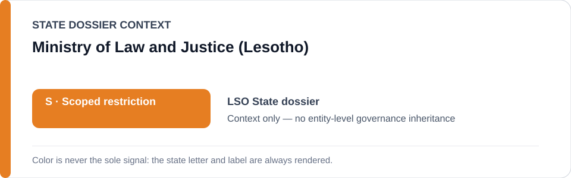
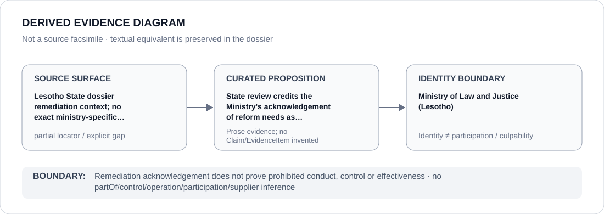

# Ministry of Law and Justice (Lesotho)

> **Canonical per-entity evidence/provenance record.** This dossier has no licensing effect by itself and carries no standalone `provisional_outcome`.

## Identity scope

This record materializes **Ministry of Law and Justice (Lesotho)** as a canonical Agency identity. Identity, mandate, parent hierarchy, source production or adjacency to a State project does not by itself establish Material Participation, control, operation, culpability or a governance outcome.

## State governance context

The canonical `LSO` State dossier records **S — Scoped restriction**. State `S` is context only and is not inherited by this Agency.

## Evidence record

The State dossier records the Ministry of Law and Justice as part of reform/remediation context and credits acknowledgement of reform needs against a broader State attribution.

Source granularity is **partial**. The repository retains the proposition/context but not a one-to-one exact locator at the same identity/proposition granularity; that gap remains explicit.

## Attribution and exclusions

Remediation acknowledgement does not prove prohibited conduct, control or effectiveness. The dossier creates no `partOf`, control, operation, participation, deployment, command, supplier or culpability edge from institutional hierarchy or evidence adjacency. Remedial, oversight, judicial and unrelated lawful functions remain excluded unless separately evidenced.

## Visual evidence

The diagram renders `source surface → curated proposition → identity boundary`; it is not a source facsimile and does not invent a `Claim` or `EvidenceItem`.

## Evidence gaps

The retained source list does not preserve a one-to-one ministry locator for that acknowledgement. The repository therefore keeps this row partial and does not infer implementation, effectiveness or involvement in correctional abuse.

## Sources

- [Lesotho State dossier](../states/LSO.md)
- [LENA Ombudsman follow-up](https://www.lena.gov.ls/lcs-resists-ombudsman-recommendations/)

## Governance boundary

This canonical dossier is an identity/provenance surface only. State context, statutory capacity, parent/subordinate naming, project proximity and evidence production never propagate into an Agency-level restriction without separate proposition-specific evidence.
