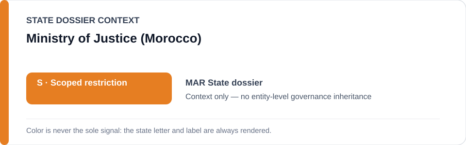
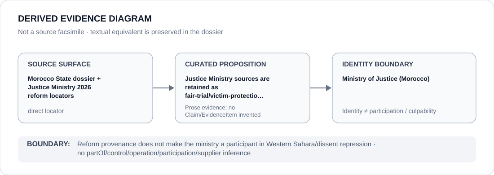

# Ministry of Justice (Morocco)

> **Canonical per-entity evidence/provenance record.** This dossier has no licensing effect by itself and carries no standalone `provisional_outcome`.

## Identity scope

This record materializes **Ministry of Justice (Morocco)** as a canonical Agency identity. Identity, mandate, parent hierarchy, source production or adjacency to a State project does not by itself establish Material Participation, control, operation, culpability or a governance outcome.

## State governance context

The canonical `MAR` State dossier records **S — Scoped restriction**. State `S` is context only and is not inherited by this Agency.

## Evidence record

The Morocco dossier preserves Justice Ministry sources as reform and counter-evidence concerning criminal procedure, fair-trial safeguards and victim-protection cooperation; those sources are explicitly not conduct evidence.

Source granularity is **direct**. The repository retains an exact source/freeze surface adequate for this curated proposition.

## Attribution and exclusions

Reform provenance does not make the ministry a participant in Western Sahara/dissent repression. The dossier creates no `partOf`, control, operation, participation, deployment, command, supplier or culpability edge from institutional hierarchy or evidence adjacency. Remedial, oversight, judicial and unrelated lawful functions remain excluded unless separately evidenced.

## Visual evidence

The diagram renders `source surface → curated proposition → identity boundary`; it is not a source facsimile and does not invent a `Claim` or `EvidenceItem`.

## Evidence gaps

The ministry's reform record does not establish remediation of every underlying retaliation case, nor participation in police, intelligence, judicial or surveillance projects.

## Sources

- [Morocco State dossier](../states/MAR.md)
- [Justice Ministry — 9 May 2026](https://justice.gov.ma/2026/05/09/)
- [Justice Ministry — 22 April 2026](https://justice.gov.ma/2026/04/22/)
- [Justice Ministry — 19 March 2026](https://justice.gov.ma/2026/03/19/15475/)

## Governance boundary

This canonical dossier is an identity/provenance surface only. State context, statutory capacity, parent/subordinate naming, project proximity and evidence production never propagate into an Agency-level restriction without separate proposition-specific evidence.
