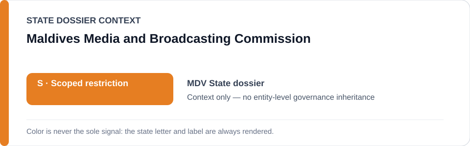
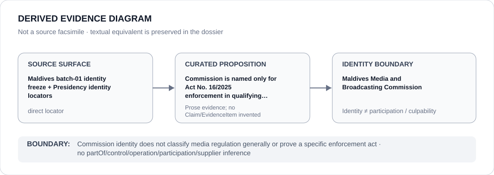

# Maldives Media and Broadcasting Commission

> **Canonical per-entity evidence/provenance record.** This dossier has no licensing effect by itself and carries no standalone `provisional_outcome`.

## Identity scope

This record materializes **Maldives Media and Broadcasting Commission** as a canonical Agency identity. Identity, mandate, parent hierarchy, source production or adjacency to a State project does not by itself establish Material Participation, control, operation, culpability or a governance outcome.

## State governance context

The canonical `MDV` State dossier records **S — Scoped restriction**. State `S` is context only and is not inherited by this Agency.

## Evidence record

The batch-01 freeze names the Maldives Media and Broadcasting Commission only when enforcing Act No. 16/2025 or successor powers in a manner that independently satisfies ECL criteria.

Source granularity is **direct**. The repository retains an exact source/freeze surface adequate for this curated proposition.

## Attribution and exclusions

Commission identity does not classify media regulation generally or prove a specific enforcement act. The dossier creates no `partOf`, control, operation, participation, deployment, command, supplier or culpability edge from institutional hierarchy or evidence adjacency. Remedial, oversight, judicial and unrelated lawful functions remain excluded unless separately evidenced.

## Visual evidence

The diagram renders `source surface → curated proposition → identity boundary`; it is not a source facsimile and does not invent a `Claim` or `EvidenceItem`.

## Evidence gaps

Identity and statutory capacity are resolved; a particular fine, suspension, closure or source-compulsion action still requires proposition-specific evidence.

## Sources

- [Maldives State dossier](../states/MDV.md)
- [Batch-01 identity freeze](../../registry/schedule-state-s-freezes/batch-01-identity.yml)
- [Presidency identity record 34936](https://presidency.gov.mv/Press/Article/34936)
- [Presidency identity record 34942](https://presidency.gov.mv/Press/Article/34942)

## Governance boundary

This canonical dossier is an identity/provenance surface only. State context, statutory capacity, parent/subordinate naming, project proximity and evidence production never propagate into an Agency-level restriction without separate proposition-specific evidence.
