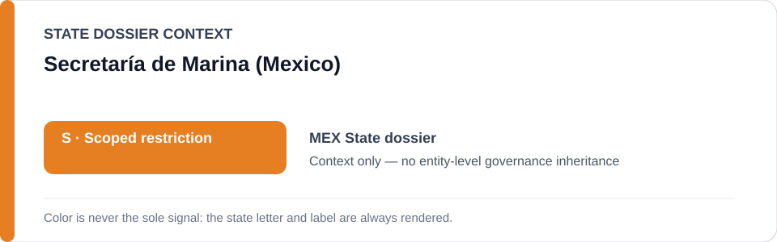
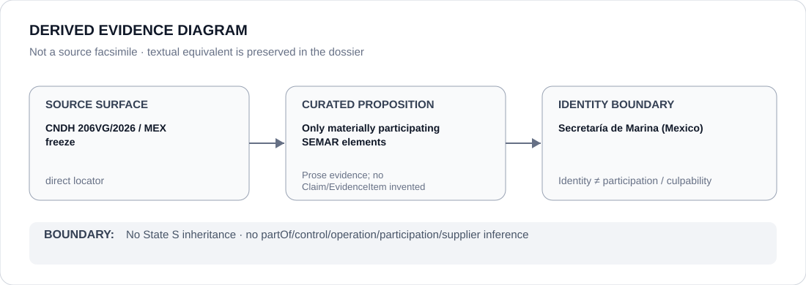

# Secretaría de Marina (Mexico)

> **Canonical per-entity evidence/provenance record.** This dossier has no licensing effect by itself and carries no standalone `provisional_outcome`.

## Identity scope

Mexico's Secretaría de Marina (SEMAR), represented as the federal naval secretariat whose **materially participating elements** are within the exact Guasave, Sinaloa `206VG/2026` project boundary preserved by the Schedule-preparation freeze. `SEMAR` resolves to this Mexican agency only.

## State governance context

The canonical `MEX` State dossier currently records **S — Scoped restriction** for specifically attributable disappearance, torture, coercive security and concrete coercive-data projects. The State dossier explicitly rejects treating military/public-security bodies as restricted classes without project-specific attribution. State `S` is therefore **context only** and is not inherited by SEMAR.

## Evidence record

- The Mexico State dossier summarizes CNDH Recommendation `206VG/2026` as attributing forced disappearance, torture and deprivation of life to Navy personnel in Guasave, Sinaloa.
- `batch-07-identified-projects.yml` freezes that exact case only and limits the actor boundary to **materially participating Secretaría de Marina elements identified by the authoritative recommendation**.
- The same freeze expressly excludes a generic Secretaría de Marina, armed-forces, police or biometric-infrastructure class.

## Attribution and exclusions

This dossier does not mark SEMAR as a whole as participating in the Guasave project. Ordinary naval/public-security activity is excluded, as are CNDH and victim/search/remediation functions. Any element-level participation must remain supported by the authoritative recommendation or separately curated evidence.

## Visual evidence

The diagram encodes the only defensible actor proposition at this layer: materially participating SEMAR elements may fall within the exact frozen case, while generic SEMAR remains excluded.

## Evidence gaps

This dossier does not enumerate the specific SEMAR personnel/elements identified in Recommendation `206VG/2026`, create element-level relation edges, or generalize from this case to other Navy operations. Those details require structured, proposition-specific evidence if added later.

## Sources

- [CNDH Recommendation 206VG/2026](https://hist.cndh.org.mx/index.php/documento/recomendacion-206vg2026)
- [Canonical Mexico State dossier](../states/MEX.md)
- [Identified-project Schedule freeze](../../registry/schedule-state-s-freezes/batch-07-identified-projects.yml)

## Governance boundary

A project-specific finding concerning materially participating SEMAR elements does not create an agency-wide restriction, organization-wide participation, control, command, culpability or Material Participation. The orange `S` is State context only.
