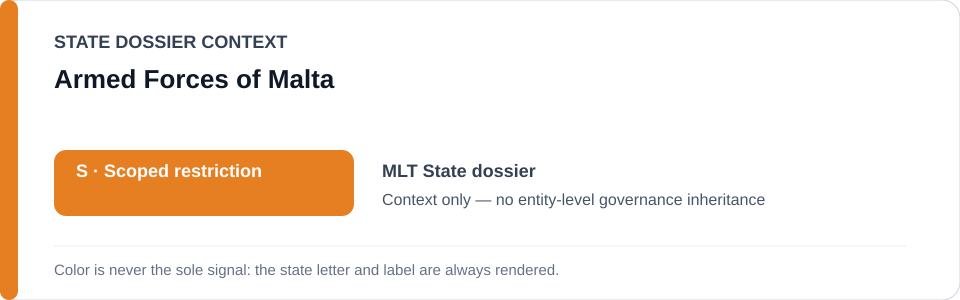
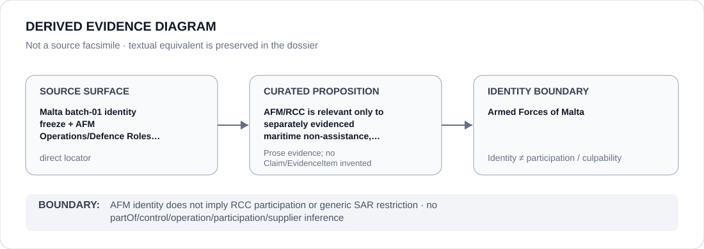

# Armed Forces of Malta

> **Canonical per-entity evidence/provenance record.** This dossier has no licensing effect by itself and carries no standalone `provisional_outcome`.

## Identity scope

This record materializes **Armed Forces of Malta** as a canonical Agency identity. Identity, mandate, parent hierarchy, source production or adjacency to a State project does not by itself establish Material Participation, control, operation, culpability or a governance outcome.

## State governance context

The canonical `MLT` State dossier records **S — Scoped restriction**. State `S` is context only and is not inherited by this Agency.

## Evidence record

The Malta freeze names the Armed Forces of Malta, including RCC and relevant maritime/SAR units, only in a specifically evidenced maritime non-assistance, pushback or transfer operation independently satisfying ECL criteria.

Source granularity is **direct**. The repository retains an exact source/freeze surface adequate for this curated proposition.

## Attribution and exclusions

AFM identity does not imply RCC participation or generic SAR restriction. The dossier creates no `partOf`, control, operation, participation, deployment, command, supplier or culpability edge from institutional hierarchy or evidence adjacency. Remedial, oversight, judicial and unrelated lawful functions remain excluded unless separately evidenced.

## Visual evidence

The diagram renders `source surface → curated proposition → identity boundary`; it is not a source facsimile and does not invent a `Claim` or `EvidenceItem`.

## Evidence gaps

AFM membership, SAR responsibility or institutional hierarchy does not establish participation in any particular maritime incident.

## Sources

- [Malta State dossier](../states/MLT.md)
- [Batch-01 identity freeze](../../registry/schedule-state-s-freezes/batch-01-identity.yml)
- [AFM Operations Centre](https://afm.gov.mt/operations-centre/)
- [AFM Defence Roles](https://afm.gov.mt/defence-roles/)

## Governance boundary

This canonical dossier is an identity/provenance surface only. State context, statutory capacity, parent/subordinate naming, project proximity and evidence production never propagate into an Agency-level restriction without separate proposition-specific evidence.
