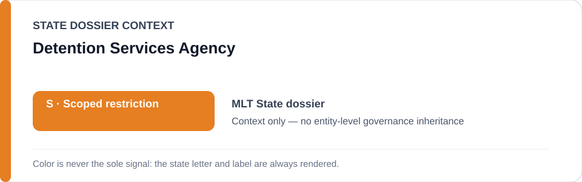
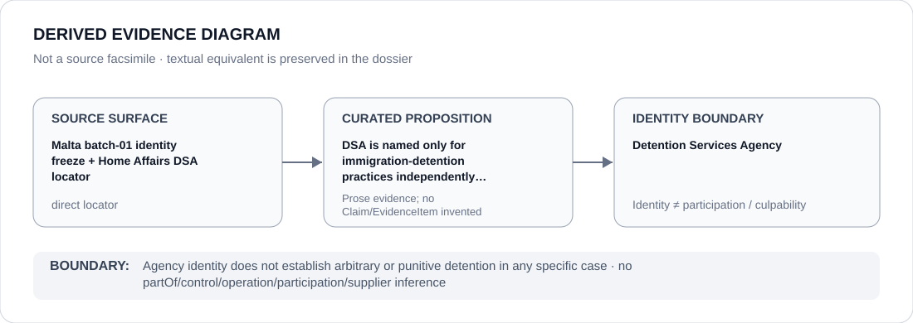

# Detention Services Agency

> **Canonical per-entity evidence/provenance record.** This dossier has no licensing effect by itself and carries no standalone `provisional_outcome`.

## Identity scope

This record materializes **Detention Services Agency** as a canonical Agency identity. Identity, mandate, parent hierarchy, source production or adjacency to a State project does not by itself establish Material Participation, control, operation, culpability or a governance outcome.

## State governance context

The canonical `MLT` State dossier records **S — Scoped restriction**. State `S` is context only and is not inherited by this Agency.

## Evidence record

The batch-01 freeze resolves the Detention Services Agency as a capacity-limited party only for immigration-detention practices that independently satisfy the ECL detention criterion.

Source granularity is **direct**. The repository retains an exact source/freeze surface adequate for this curated proposition.

## Attribution and exclusions

Agency identity does not establish arbitrary or punitive detention in any specific case. The dossier creates no `partOf`, control, operation, participation, deployment, command, supplier or culpability edge from institutional hierarchy or evidence adjacency. Remedial, oversight, judicial and unrelated lawful functions remain excluded unless separately evidenced.

## Visual evidence

The diagram renders `source surface → curated proposition → identity boundary`; it is not a source facsimile and does not invent a `Claim` or `EvidenceItem`.

## Evidence gaps

The identity record does not prove that any particular detention order, facility, officer or practice meets the qualifying threshold.

## Sources

- [Malta State dossier](../states/MLT.md)
- [Batch-01 identity freeze](../../registry/schedule-state-s-freezes/batch-01-identity.yml)
- [Home Affairs — Detention Services Agency](https://homeaffairs.gov.mt/public-bodies/detention-services-agency/)

## Governance boundary

This canonical dossier is an identity/provenance surface only. State context, statutory capacity, parent/subordinate naming, project proximity and evidence production never propagate into an Agency-level restriction without separate proposition-specific evidence.
