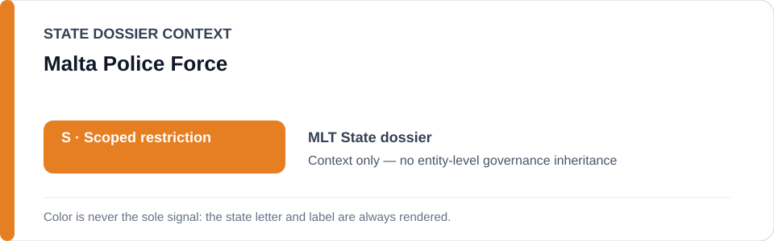
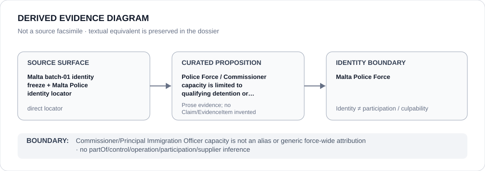

# Malta Police Force

> **Canonical per-entity evidence/provenance record.** This dossier has no licensing effect by itself and carries no standalone `provisional_outcome`.

## Identity scope

This record materializes **Malta Police Force** as a canonical Agency identity. Identity, mandate, parent hierarchy, source production or adjacency to a State project does not by itself establish Material Participation, control, operation, culpability or a governance outcome.

## State governance context

The canonical `MLT` State dossier records **S — Scoped restriction**. State `S` is context only and is not inherited by this Agency.

## Evidence record

The Malta freeze names the Malta Police Force / Commissioner of Police in the capacity of Principal Immigration Officer only for detention or removal operations independently satisfying ECL criteria.

Source granularity is **direct**. The repository retains an exact source/freeze surface adequate for this curated proposition.

## Attribution and exclusions

Commissioner/Principal Immigration Officer capacity is not an alias or generic force-wide attribution. The dossier creates no `partOf`, control, operation, participation, deployment, command, supplier or culpability edge from institutional hierarchy or evidence adjacency. Remedial, oversight, judicial and unrelated lawful functions remain excluded unless separately evidenced.

## Visual evidence

The diagram renders `source surface → curated proposition → identity boundary`; it is not a source facsimile and does not invent a `Claim` or `EvidenceItem`.

## Evidence gaps

The force identity does not establish the Commissioner's capacity in a specific act, and unrelated policing is excluded.

## Sources

- [Malta State dossier](../states/MLT.md)
- [Batch-01 identity freeze](../../registry/schedule-state-s-freezes/batch-01-identity.yml)
- [Malta Police identity surface](https://pulizija.gov.mt/en/european-union-funding/)

## Governance boundary

This canonical dossier is an identity/provenance surface only. State context, statutory capacity, parent/subordinate naming, project proximity and evidence production never propagate into an Agency-level restriction without separate proposition-specific evidence.
