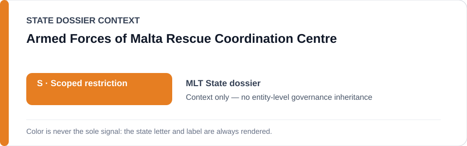
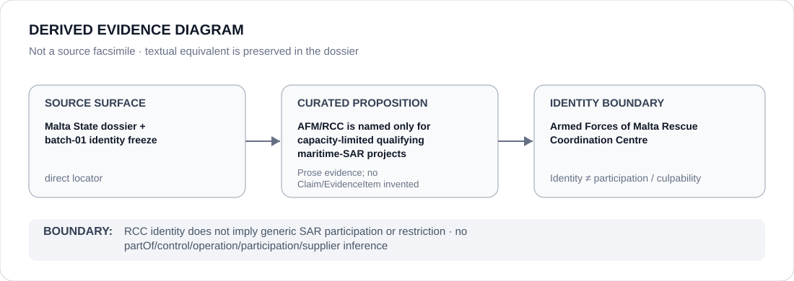

# Armed Forces of Malta Rescue Coordination Centre

> **Canonical per-entity evidence/provenance record.** This dossier has no licensing effect by itself and carries no standalone `provisional_outcome`.

## Identity scope

The Armed Forces of Malta Rescue Coordination Centre (RCC), represented as the maritime rescue-coordination unit named by the Malta Schedule-preparation freeze. This dossier records the stable agency identity and the narrow capacity in which it can become relevant; it does not classify Maltese search-and-rescue activity generally.

## State governance context

The canonical `MLT` State dossier records **S — Scoped restriction** for defined migration-detention, maritime-return/non-assistance and related coercive projects. State `S` is context only and is not inherited by RCC.

## Evidence record

- The Malta State dossier preserves current concerns around maritime non-assistance, pushback and Libya-cooperation projects where a specific operation materially facilitates unsafe return.
- `batch-01-identity.yml` names **Armed Forces of Malta / RCC and relevant maritime-SAR units** only in the capacity-limited qualifying projects defined by that freeze.
- The same State dossier expressly states that migration, detention, policing and SAR functions are not Restricted generally.

## Attribution and exclusions

RCC identity does not establish that every rescue-coordination decision, SAR function, officer or AFM element participated in a qualifying project. Courts, independent monitoring, lawful rescue and rights-remediation functions remain outside the project boundary absent separate evidence.

## Visual evidence

The diagram records the exact freeze surface and terminates at agency identity rather than propagating the State `S` or a maritime incident to RCC generally.

## Evidence gaps

The repository does not preserve proposition-specific locators for every historical maritime sub-incident discussed in the Malta review. Any future RCC-specific participation finding therefore requires an exact incident, role and evidentiary link rather than inference from institutional competence.

## Sources

- [Canonical Malta State dossier](../states/MLT.md)
- [Malta capacity-limited identity freeze](../../registry/schedule-state-s-freezes/batch-01-identity.yml)
- [Amnesty International — Malta country record](https://www.amnesty.org/en/location/europe-and-central-asia/western-central-and-south-eastern-europe/malta/report-malta/)
- [Council of Europe execution/remediation context](https://www.coe.int/en/web/execution/-/malta-meeting-with-the-state-advocate-and-the-permanent-representative-of-malta-to-the-council-of-europe)

## Governance boundary

A named RCC capacity inside a Malta freeze is not an RCC-wide restriction and does not infer `partOf`, operation, participation, control, command or culpability outside a specifically evidenced maritime project. The orange `S` is State context only.
