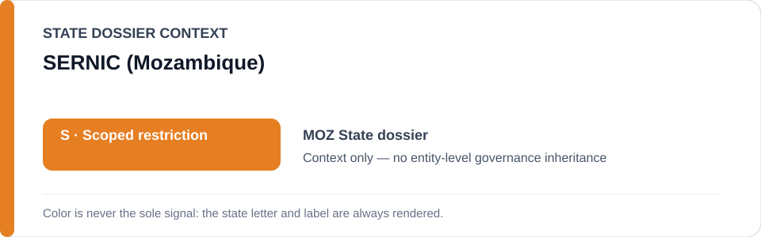
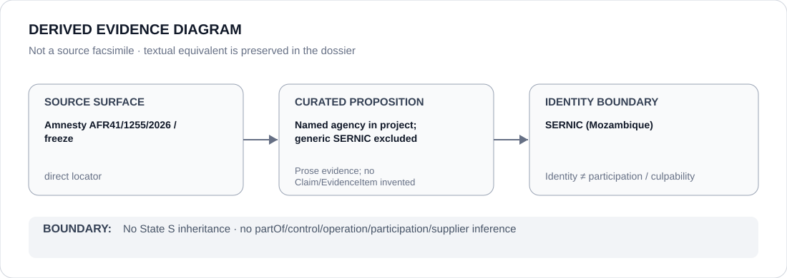

# SERNIC (Mozambique)

> **Canonical per-entity evidence/provenance record.** This dossier has no licensing effect by itself and carries no standalone `provisional_outcome`.

## Identity scope

Mozambique's National Criminal Investigation Service (SERNIC), represented as the agency named in the Pemba Estácio Valoi equipment-retention freeze and separately referenced in the State dossier as an investigative/accountability body. The `SERNIC` alias is Mozambique-scoped.

## State governance context

The canonical `MOZ` State dossier currently records **S — Scoped restriction** for specifically attributable coercive security/public-order projects. That status is shown below as **context only** and is not inherited by SERNIC.

## Evidence record

- `batch-11c-moz-freeze.yml` names Mozambique's National Criminal Investigation Service in the exact 16 June 2026 Pemba search/seizure and continued equipment-retention project concerning Estácio Valoi.
- Crucially, the same freeze expressly excludes **SERNIC or Mozambican policing generally**; only the named process is frozen.
- The Mozambique State dossier also records SERNIC/prosecutorial investigation as counter-evidence in the separate July 2026 Narciso Castigo Sambo summary-execution matter, reinforcing that agency identity cannot be collapsed into a generic adverse status.

## Attribution and exclusions

This dossier records identity and bounded project provenance only. It does not convert the named Valoi project into a generic SERNIC restriction, does not infer participation by every SERNIC unit/member and does not treat investigative/remedial activity as coercive participation absent separate evidence.

## Visual evidence

The diagram deliberately encodes the proposition as **named agency in project; generic SERNIC excluded**, preserving the project's explicit exclusion language.

## Evidence gaps

This dossier does not identify the specific SERNIC officials or subunits involved in the Valoi process, determine the present status of the retained equipment after cutoff, or create new participation edges/Claims for the Sambo investigation.

## Sources

- [Amnesty International — AFR 41/1255/2026](https://www.amnesty.org/en/documents/afr41/1255/2026/en/)
- [Canonical Mozambique State dossier](../states/MOZ.md)
- [Mozambique named-project Schedule freeze](../../registry/schedule-state-s-freezes/batch-11c-moz-freeze.yml)

## Governance boundary

Being named in one frozen project does not create a generic agency restriction, organization-wide participation, control, command, culpability or Material Participation. The orange `S` is State context only.
