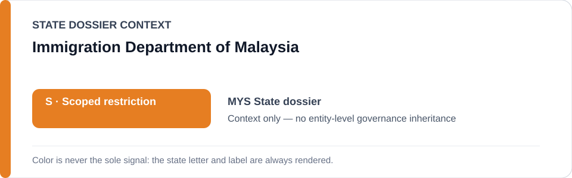
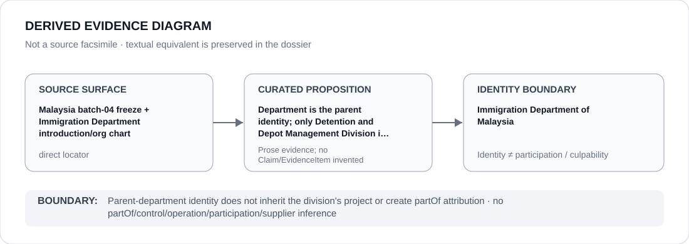

# Immigration Department of Malaysia

> **Canonical per-entity evidence/provenance record.** This dossier has no licensing effect by itself and carries no standalone `provisional_outcome`.

## Identity scope

This record materializes **Immigration Department of Malaysia** as a canonical Agency identity. Identity, mandate, parent hierarchy, source production or adjacency to a State project does not by itself establish Material Participation, control, operation, culpability or a governance outcome.

## State governance context

The canonical `MYS` State dossier records **S — Scoped restriction**. State `S` is context only and is not inherited by this Agency.

## Evidence record

The official Immigration Department introduction and organization chart resolve the parent department while batch-04 narrows Schedule renderability to the Detention and Depot Management Division in qualifying detention/depot operations.

Source granularity is **direct**. The repository retains an exact source/freeze surface adequate for this curated proposition.

## Attribution and exclusions

Parent-department identity does not inherit the division's project or create partOf attribution. The dossier creates no `partOf`, control, operation, participation, deployment, command, supplier or culpability edge from institutional hierarchy or evidence adjacency. Remedial, oversight, judicial and unrelated lawful functions remain excluded unless separately evidenced.

## Visual evidence

The diagram renders `source surface → curated proposition → identity boundary`; it is not a source facsimile and does not invent a `Claim` or `EvidenceItem`.

## Evidence gaps

The dossier creates no partOf relation, department-wide restriction or attribution from the narrower division to ordinary immigration administration.

## Sources

- [Malaysia State dossier](../states/MYS.md)
- [Batch-04 detention/digital freeze](../../registry/schedule-state-s-freezes/batch-04-detention-digital.yml)
- [Immigration Department introduction](https://www.imi.gov.my/index.php/en/departments-profile/introduction/)
- [Immigration Department organization chart](https://www.imi.gov.my/index.php/en/departments-profile/organization-chart/)

## Governance boundary

This canonical dossier is an identity/provenance surface only. State context, statutory capacity, parent/subordinate naming, project proximity and evidence production never propagate into an Agency-level restriction without separate proposition-specific evidence.
