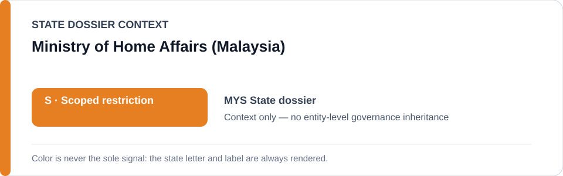
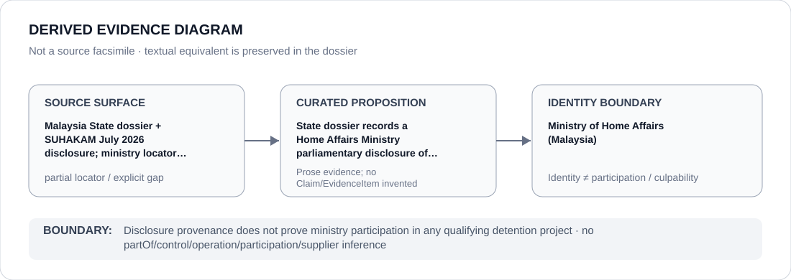

# Ministry of Home Affairs (Malaysia)

> **Canonical per-entity evidence/provenance record.** This dossier has no licensing effect by itself and carries no standalone `provisional_outcome`.

## Identity scope

This record materializes **Ministry of Home Affairs (Malaysia)** as a canonical Agency identity. Identity, mandate, parent hierarchy, source production or adjacency to a State project does not by itself establish Material Participation, control, operation, culpability or a governance outcome.

## State governance context

The canonical `MYS` State dossier records **S — Scoped restriction**. State `S` is context only and is not inherited by this Agency.

## Evidence record

The Malaysia dossier records SUHAKAM's July 2026 account of the Home Affairs Ministry's parliamentary disclosure that 465 deaths occurred in immigration detention depots between 2021 and 2025.

Source granularity is **partial**. The repository retains the proposition/context but not a one-to-one exact locator at the same identity/proposition granularity; that gap remains explicit.

## Attribution and exclusions

Disclosure provenance does not prove ministry participation in any qualifying detention project. The dossier creates no `partOf`, control, operation, participation, deployment, command, supplier or culpability edge from institutional hierarchy or evidence adjacency. Remedial, oversight, judicial and unrelated lawful functions remain excluded unless separately evidenced.

## Visual evidence

The diagram renders `source surface → curated proposition → identity boundary`; it is not a source facsimile and does not invent a `Claim` or `EvidenceItem`.

## Evidence gaps

The repository retains the SUHAKAM locator but no separate ministry-specific one-to-one source for the disclosure at this granularity. Disclosure and oversight context are not Material Participation.

## Sources

- [Malaysia State dossier](../states/MYS.md)
- [SUHAKAM detention-centre reform statement](https://suhakam.org.my/2026/07/media-statement-no-38-2026_suhakam-calls-for-urgent-reforms-to-immigration-detention-centres/)

## Governance boundary

This canonical dossier is an identity/provenance surface only. State context, statutory capacity, parent/subordinate naming, project proximity and evidence production never propagate into an Agency-level restriction without separate proposition-specific evidence.
