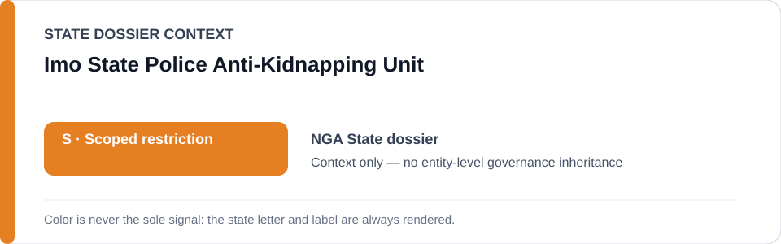
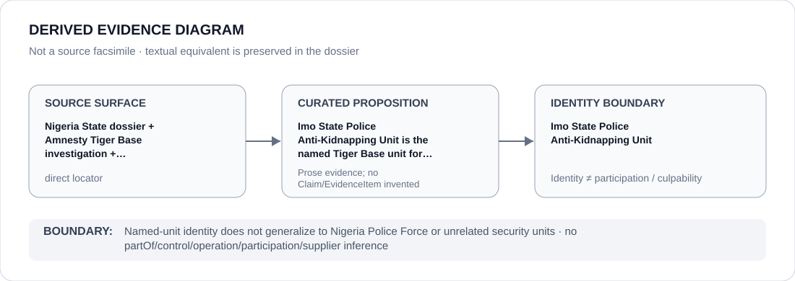

# Imo State Police Anti-Kidnapping Unit

> **Canonical per-entity evidence/provenance record.** This dossier has no licensing effect by itself and carries no standalone `provisional_outcome`.

## Identity scope

This record materializes **Imo State Police Anti-Kidnapping Unit** as a canonical Agency identity. Identity, mandate, parent hierarchy, source production or adjacency to a State project does not by itself establish Material Participation, control, operation, culpability or a governance outcome.

## State governance context

The canonical `NGA` State dossier records **S — Scoped restriction**. State `S` is context only and is not inherited by this Agency.

## Evidence record

The Nigeria dossier and promoted-ready-03a identify the Imo State Police Anti-Kidnapping Unit (Tiger Base) as the named unit for the documented detention/custody project and materially continuous unremediated operations.

Source granularity is **direct**. The repository retains an exact source/freeze surface adequate for this curated proposition.

## Attribution and exclusions

Named-unit identity does not generalize to Nigeria Police Force or unrelated security units. The dossier creates no `partOf`, control, operation, participation, deployment, command, supplier or culpability edge from institutional hierarchy or evidence adjacency. Remedial, oversight, judicial and unrelated lawful functions remain excluded unless separately evidenced.

## Visual evidence

The diagram renders `source surface → curated proposition → identity boundary`; it is not a source facsimile and does not invent a `Claim` or `EvidenceItem`.

## Evidence gaps

Unit identity does not adjudicate individual responsibility, every custody event or the Nigeria Police Force generally; project continuity and remediation remain reviewable.

## Sources

- [Nigeria State dossier](../states/NGA.md)
- [Promoted Schedule surface](../../registry/schedule-state-s-freezes/promoted-ready-03a.yml)
- [Amnesty Tiger Base investigation](https://www.amnesty.org/en/documents/afr44/0719/2026/en/)

## Governance boundary

This canonical dossier is an identity/provenance surface only. State context, statutory capacity, parent/subordinate naming, project proximity and evidence production never propagate into an Agency-level restriction without separate proposition-specific evidence.
