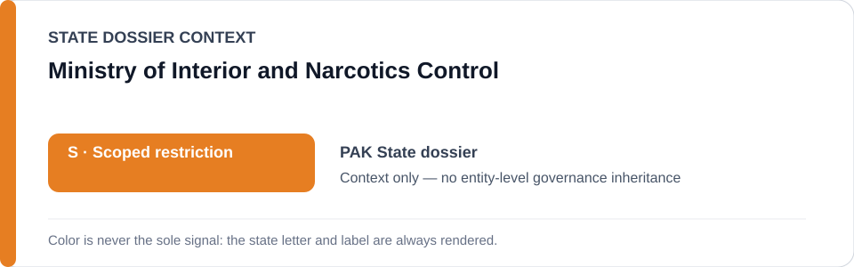
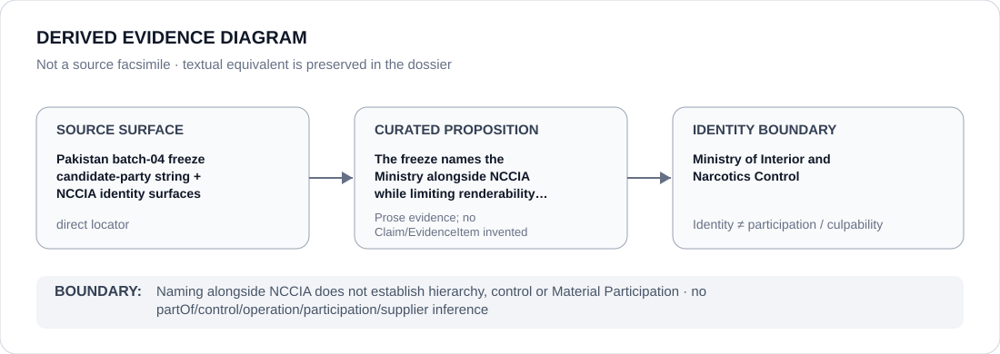

# Ministry of Interior and Narcotics Control

> **Canonical per-entity evidence/provenance record.** This dossier has no licensing effect by itself and carries no standalone `provisional_outcome`.

## Identity scope

This record materializes `AGENCY-PAK-MINISTRY-INTERIOR-NARCOTICS-CONTROL` as the dedicated dossier for **Ministry of Interior and Narcotics Control**. The ABox identity does not by itself establish control, operation, participation, deployment, command, supply, culpability or any ECL governance result.

## State governance context

The canonical `PAK` State dossier records **S — Scoped restriction**. That State status is context only and is **not inherited** by Ministry of Interior and Narcotics Control.

## Evidence record

The freeze names the Ministry alongside NCCIA while limiting renderability to qualifying PECA enforcement.

The retained repository surface is sufficiently exact for this curated proposition and is recorded as `direct`.

## Attribution and exclusions

Naming alongside NCCIA does not establish hierarchy, control or Material Participation. Identity, organizational naming, evidence production, parent/subordinate proximity and State context are insufficient to establish a broader restriction or Material Participation.

## Visual evidence

The diagram encodes the curated proposition **“The freeze names the Ministry alongside NCCIA while limiting renderability to qualifying PECA enforcement”** and terminates at the identity boundary. It does not create a new `Claim`, `EvidenceItem`, relation edge, Schedule entry or Material Participation finding.

## Evidence gaps

No source-precision gap is asserted for the curated proposition. Project/case-level Material Participation still requires its own evidence.

## Sources

- [Canonical PAK State dossier](../states/PAK.md)
- [Controlling Schedule-preparation boundary](../../registry/schedule-state-s-freezes/batch-04-detention-digital.yml)
- https://www.nccia.gov.pk/WhatWeAre.php

## Governance boundary

Naming alongside NCCIA does not establish hierarchy, control or Material Participation. No `partOf`, `sameAs`, control, operation, participation, supplier or culpability edge is inferred unless separately encoded and evidenced.
