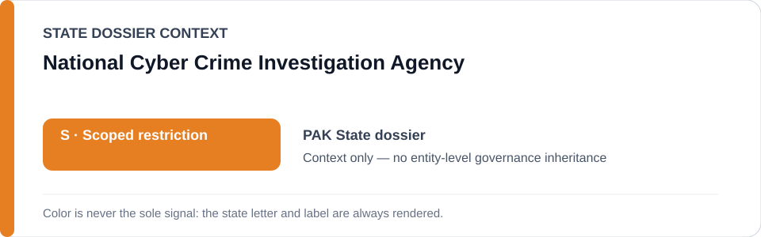
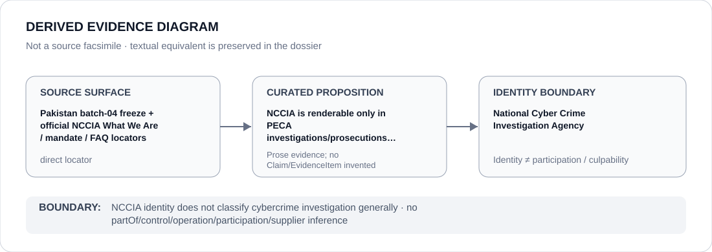

# National Cyber Crime Investigation Agency

> **Canonical per-entity evidence/provenance record.** This dossier has no licensing effect by itself and carries no standalone `provisional_outcome`.

## Identity scope

This record materializes `AGENCY-PAK-NCCIA` as the dedicated dossier for **National Cyber Crime Investigation Agency**. The ABox identity does not by itself establish control, operation, participation, deployment, command, supply, culpability or any ECL governance result.

## State governance context

The canonical `PAK` State dossier records **S — Scoped restriction**. That State status is context only and is **not inherited** by National Cyber Crime Investigation Agency.

## Evidence record

NCCIA is renderable only in PECA investigations/prosecutions against protected journalism or expression independently satisfying ECL criteria.

The retained repository surface is sufficiently exact for this curated proposition and is recorded as `direct`.

## Attribution and exclusions

NCCIA identity does not classify cybercrime investigation generally. Identity, organizational naming, evidence production, parent/subordinate proximity and State context are insufficient to establish a broader restriction or Material Participation.

## Visual evidence

The diagram encodes the curated proposition **“NCCIA is renderable only in PECA investigations/prosecutions against protected journalism or expression independently satisfying ECL criteria”** and terminates at the identity boundary. It does not create a new `Claim`, `EvidenceItem`, relation edge, Schedule entry or Material Participation finding.

## Evidence gaps

No source-precision gap is asserted for the curated proposition. Project/case-level Material Participation still requires its own evidence.

## Sources

- [Canonical PAK State dossier](../states/PAK.md)
- [Controlling Schedule-preparation boundary](../../registry/schedule-state-s-freezes/batch-04-detention-digital.yml)
- https://www.nccia.gov.pk/WhatWeAre.php
- https://www.nccia.gov.pk/mandate.php

## Governance boundary

NCCIA identity does not classify cybercrime investigation generally. No `partOf`, `sameAs`, control, operation, participation, supplier or culpability edge is inferred unless separately encoded and evidenced.
