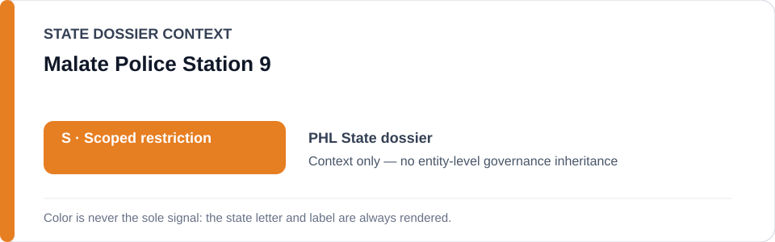
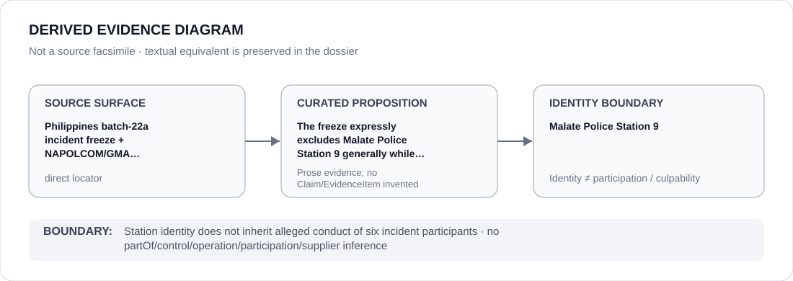

# Malate Police Station 9

> **Canonical per-entity evidence/provenance record.** This dossier has no licensing effect by itself and carries no standalone `provisional_outcome`.

## Identity scope

This record materializes `AGENCY-PHL-MALATE-POLICE-STATION-9` as the dedicated dossier for **Malate Police Station 9**. The ABox identity does not by itself establish control, operation, participation, deployment, command, supply, culpability or any ECL governance result.

## State governance context

The canonical `PHL` State dossier records **S — Scoped restriction**. That State status is context only and is **not inherited** by Malate Police Station 9.

## Evidence record

The freeze expressly excludes Malate Police Station 9 generally while preserving only the 28 January 2026 incident.

The retained repository surface is sufficiently exact for this curated proposition and is recorded as `direct`.

## Attribution and exclusions

Station identity does not inherit alleged conduct of six incident participants. Identity, organizational naming, evidence production, parent/subordinate proximity and State context are insufficient to establish a broader restriction or Material Participation.

## Visual evidence

The diagram encodes the curated proposition **“The freeze expressly excludes Malate Police Station 9 generally while preserving only the 28 January 2026 incident”** and terminates at the identity boundary. It does not create a new `Claim`, `EvidenceItem`, relation edge, Schedule entry or Material Participation finding.

## Evidence gaps

No source-precision gap is asserted for the curated proposition. Project/case-level Material Participation still requires its own evidence.

## Sources

- [Canonical PHL State dossier](../states/PHL.md)
- [Controlling Schedule-preparation boundary](../../registry/schedule-state-s-freezes/batch-22a-phl-freeze.yml)
- https://napolcom.gov.ph/niro/pid/index.html
- https://www.gmanetwork.com/news/topstories/metro/974800/napolcom-6-manila-cops-in-alleged-makati-robbery-face-admin-complaint/story/

## Governance boundary

Station identity does not inherit alleged conduct of six incident participants. No `partOf`, `sameAs`, control, operation, participation, supplier or culpability edge is inferred unless separately encoded and evidenced.
