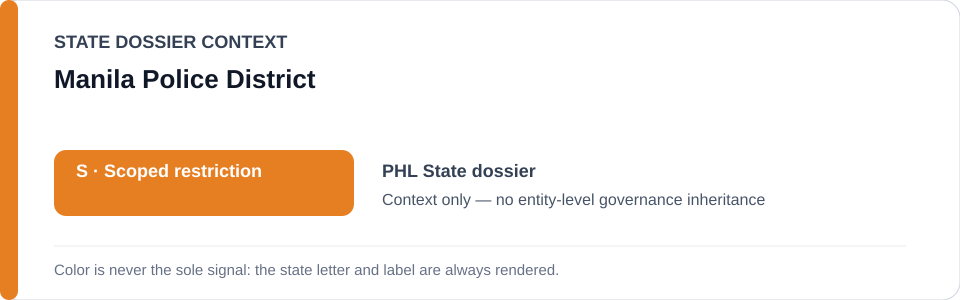
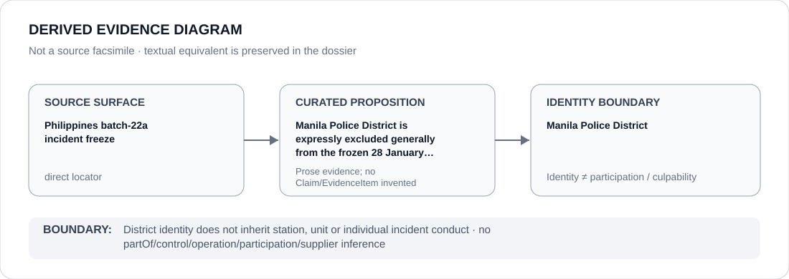

# Manila Police District

> **Canonical per-entity evidence/provenance record.** This dossier has no licensing effect by itself and carries no standalone `provisional_outcome`.

## Identity scope

This record materializes `AGENCY-PHL-MANILA-POLICE-DISTRICT` as the dedicated dossier for **Manila Police District**. The ABox identity does not by itself establish control, operation, participation, deployment, command, supply, culpability or any ECL governance result.

## State governance context

The canonical `PHL` State dossier records **S — Scoped restriction**. That State status is context only and is **not inherited** by Manila Police District.

## Evidence record

Manila Police District is expressly excluded generally from the frozen 28 January 2026 SDEU incident.

The retained repository surface is sufficiently exact for this curated proposition and is recorded as `direct`.

## Attribution and exclusions

District identity does not inherit station, unit or individual incident conduct. Identity, organizational naming, evidence production, parent/subordinate proximity and State context are insufficient to establish a broader restriction or Material Participation.

## Visual evidence

The diagram encodes the curated proposition **“Manila Police District is expressly excluded generally from the frozen 28 January 2026 SDEU incident”** and terminates at the identity boundary. It does not create a new `Claim`, `EvidenceItem`, relation edge, Schedule entry or Material Participation finding.

## Evidence gaps

No source-precision gap is asserted for the curated proposition. Project/case-level Material Participation still requires its own evidence.

## Sources

- [Canonical PHL State dossier](../states/PHL.md)
- [Controlling Schedule-preparation boundary](../../registry/schedule-state-s-freezes/batch-22a-phl-freeze.yml)

## Governance boundary

District identity does not inherit station, unit or individual incident conduct. No `partOf`, `sameAs`, control, operation, participation, supplier or culpability edge is inferred unless separately encoded and evidenced.
