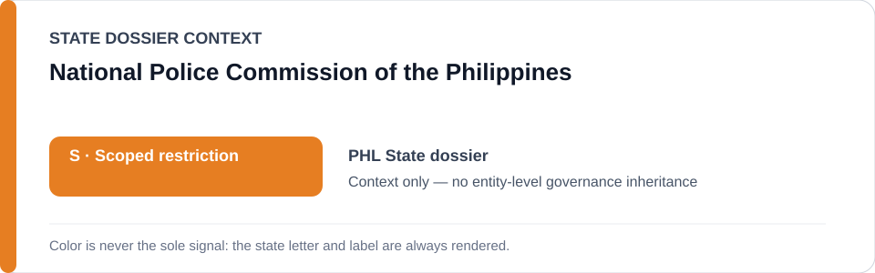
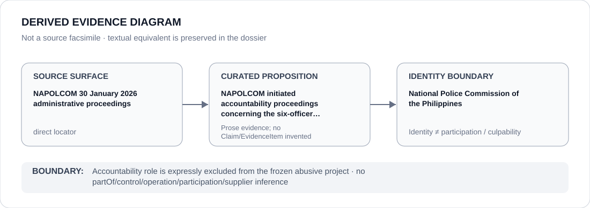

# National Police Commission of the Philippines

> **Canonical per-entity evidence/provenance record.** This dossier has no licensing effect by itself and carries no standalone `provisional_outcome`.

## Identity scope

The National Police Commission (NAPOLCOM), represented as the Philippine police oversight and administrative-accountability body named in the current Malate Police Station 9 SDEU case record. This dossier records its identity and evidentiary role; it does not equate police oversight with participation in the underlying alleged abusive operation.

## State governance context

The canonical `PHL` State dossier records **S — Scoped restriction** for the exact 28 January 2026 Barangay San Isidro incident involving six Malate Police Station 9 SDEU personnel. State `S` is context only and is not inherited by NAPOLCOM.

## Evidence record

- On 30 January 2026 NAPOLCOM announced administrative proceedings concerning six SDEU personnel arrested after the 28 January incident.
- The State dossier treats those proceedings as material accountability/counter-evidence and uses them to defeat a generic PNP/MPD/anti-drug restriction.
- `batch-22a-phl-freeze.yml` expressly excludes NAPOLCOM from the frozen abusive project while preserving the finite incident and materially participating alleged abusive functions.

## Attribution and exclusions

Administrative investigation, discipline, oversight and accountability are not participation in the alleged unauthorized anti-drug/armed-robbery operation. NAPOLCOM is therefore outside the frozen project absent separate contradictory evidence.

## Visual evidence

The diagram records the accountability proposition and stops at NAPOLCOM identity; it does not turn remedial adjacency into agency-wide effectiveness or governance.

## Evidence gaps

Pending criminal/administrative proceedings may change the underlying incident attribution. This dossier does not predict their outcome and does not infer generic effectiveness from one accountability action.

## Sources

- [Canonical Philippines State dossier](../states/PHL.md)
- [Philippines exact incident freeze](../../registry/schedule-state-s-freezes/batch-22a-phl-freeze.yml)
- [NAPOLCOM official record](https://napolcom.gov.ph/niro/pid/index.html)
- [GMA News — NAPOLCOM administrative complaint report](https://www.gmanetwork.com/news/topstories/metro/974800/napolcom-6-manila-cops-in-alleged-makati-robbery-face-admin-complaint/story/)

## Governance boundary

NAPOLCOM's accountability role is expressly excluded from the frozen project. The orange `S` is State context only and does not establish NAPOLCOM participation, culpability or blanket remedial effectiveness.
