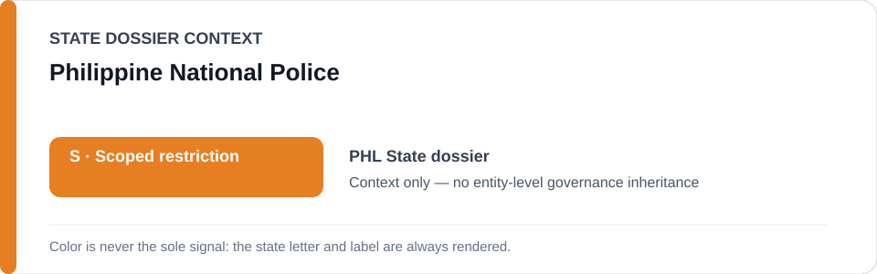
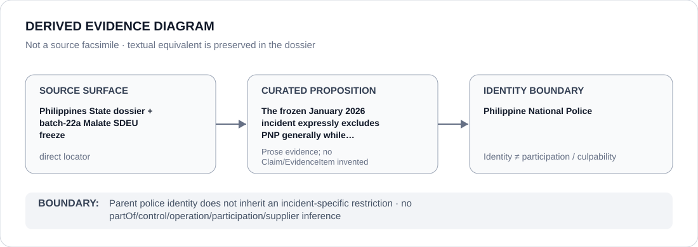

# Philippine National Police

> **Canonical per-entity evidence/provenance record.** This dossier has no licensing effect by itself and carries no standalone `provisional_outcome`.

## Identity scope

The Philippine National Police (PNP), represented as the nationwide parent police identity above the Manila/Malate incident surface. The current freeze deliberately solves knowability by restricting an exact incident rather than PNP as an institution.

## State governance context

The canonical `PHL` State dossier records **S — Scoped restriction** for the exact 28 January 2026 Barangay San Isidro incident involving six Malate Police Station 9 SDEU personnel. It expressly excludes PNP generally. State `S` is context only and is not inherited by PNP.

## Evidence record

- NAPOLCOM announced administrative proceedings against six SDEU personnel following the finite January 2026 incident.
- `batch-22a-phl-freeze.yml` freezes only the incident and materially participating alleged abusive functions.
- PNP, MPD, Malate Police Station 9 and SDEUs generally are expressly excluded from the frozen class.

## Attribution and exclusions

Parent-agency hierarchy, employment or ordinary anti-drug/policing activity does not establish Material Participation in the frozen incident. NAPOLCOM, Makati police who arrested the suspects, prosecutors, courts, defence counsel and unrelated personnel/functions remain excluded.

## Visual evidence

The diagram shows the exact incident boundary and prevents propagation upward to the nationwide PNP identity.

## Evidence gaps

Pending criminal/administrative proceedings can change the exact incident attribution. This dossier makes no finding of individual guilt and no PNP-wide inference.

## Sources

- [Canonical Philippines State dossier](../states/PHL.md)
- [Philippines Malate incident freeze](../../registry/schedule-state-s-freezes/batch-22a-phl-freeze.yml)
- [NAPOLCOM official record](https://napolcom.gov.ph/niro/pid/index.html)
- [GMA News case report](https://www.gmanetwork.com/news/topstories/metro/974800/napolcom-6-manila-cops-in-alleged-makati-robbery-face-admin-complaint/story/)

## Governance boundary

PNP is a parent police identity, not the frozen incident. The orange `S` is State context only and creates no agency-wide participation, control, command or culpability finding.
