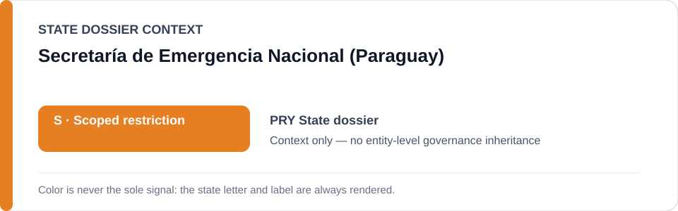
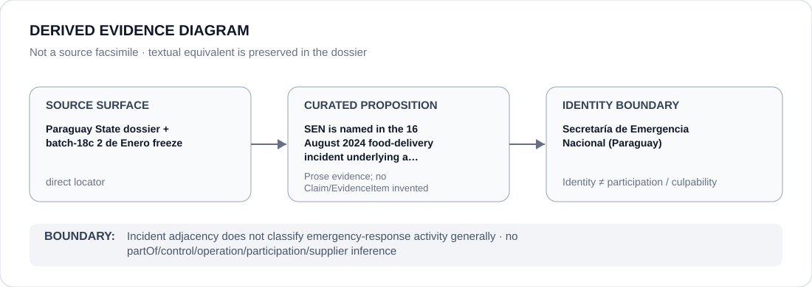

# Secretaría de Emergencia Nacional (Paraguay)

> **Canonical per-entity evidence/provenance record.** This dossier has no licensing effect by itself and carries no standalone `provisional_outcome`.

## Identity scope

The Secretaría de Emergencia Nacional (SEN), represented as the Paraguayan emergency authority named in the Community 2 de Enero incident/prosecution freeze. The identity record is bounded to that evidentiary context and does not classify emergency-response activity generally.

## State governance context

The canonical `PRY` State dossier records **S — Scoped restriction** for specific protest/defender and Indigenous-rights enforcement projects. State `S` is context only and is not inherited by SEN.

## Evidence record

- The Paraguay dossier preserves Indigenous-rights, displacement and defender-criminalisation concerns while requiring concrete State attribution.
- `batch-18c-pry-freeze.yml` freezes only the Community 2 de Enero prosecution arising from the **16 August 2024 SEN food-delivery incident**, limited to the continuing proceeding against three Ayoreo community members while the retaliation/due-process concern remains active.
- Other public-administration, emergency-response, protest and land-enforcement activity remains outside that freeze absent separate evidence.

## Attribution and exclusions

SEN's presence in the incident history does not establish that the agency, its emergency-response mandate or unrelated staff materially participated in prohibited conduct. Any agency-level or personnel-level proposition requires separate evidence of the exact role in the qualifying project.

## Visual evidence

The diagram records the incident/prosecution link and terminates at SEN identity rather than propagating the State `S` or the prosecution concern to emergency-response work generally.

## Evidence gaps

The repository does not preserve a one-to-one event locator for every component of the 16 August 2024 incident. The current freeze supplies the exact procedural boundary; finer SEN role attribution remains evidence-dependent and is not reconstructed externally.

## Sources

- [Canonical Paraguay State dossier](../states/PRY.md)
- [Paraguay Community 2 de Enero freeze](../../registry/schedule-state-s-freezes/batch-18c-pry-freeze.yml)
- [Amnesty International — Paraguay country record](https://www.amnesty.org/es/location/americas/south-america/paraguay/)
- [Iniciativa Amotocodie — Ayoreo criminalisation record](https://www.iniciativa-amotocodie.org/2026/04/21/criminalization-indigenous-demands-paraguay-ayoreo/)

## Governance boundary

SEN identity and incident adjacency do not create an agency-wide restriction or infer operation, participation, control, command or culpability. The orange `S` is State context only.
