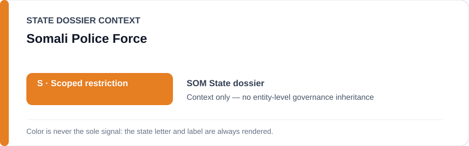
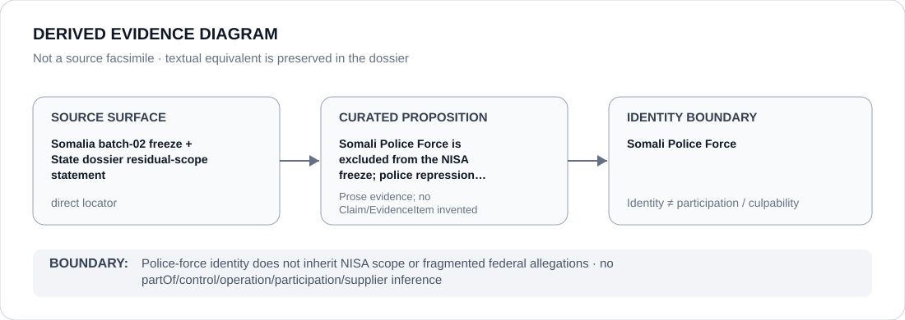

# Somali Police Force

> **Canonical per-entity evidence/provenance record.** This dossier has no licensing effect by itself and carries no standalone `provisional_outcome`.

## Identity scope

This record materializes `AGENCY-SOM-SOMALI-POLICE-FORCE` as the dedicated dossier for **Somali Police Force**. The ABox identity does not by itself establish control, operation, participation, deployment, command, supply, culpability or any ECL governance result.

## State governance context

The canonical `SOM` State dossier records **S — Scoped restriction**. That State status is context only and is **not inherited** by Somali Police Force.

## Evidence record

Somali Police Force is excluded from the NISA freeze; police repression remains residual until exact unit/case attribution exists.

The retained repository surface is sufficiently exact for this curated proposition and is recorded as `direct`.

## Attribution and exclusions

Police-force identity does not inherit NISA scope or fragmented federal allegations. Identity, organizational naming, evidence production, parent/subordinate proximity and State context are insufficient to establish a broader restriction or Material Participation.

## Visual evidence

The diagram encodes the curated proposition **“Somali Police Force is excluded from the NISA freeze; police repression remains residual until exact unit/case attribution exists”** and terminates at the identity boundary. It does not create a new `Claim`, `EvidenceItem`, relation edge, Schedule entry or Material Participation finding.

## Evidence gaps

No source-precision gap is asserted for the curated proposition. Project/case-level Material Participation still requires its own evidence.

## Sources

- [Canonical SOM State dossier](../states/SOM.md)
- [Controlling Schedule-preparation boundary](../../registry/schedule-state-s-freezes/batch-02-statutory-agency.yml)

## Governance boundary

Police-force identity does not inherit NISA scope or fragmented federal allegations. No `partOf`, `sameAs`, control, operation, participation, supplier or culpability edge is inferred unless separately encoded and evidenced.
